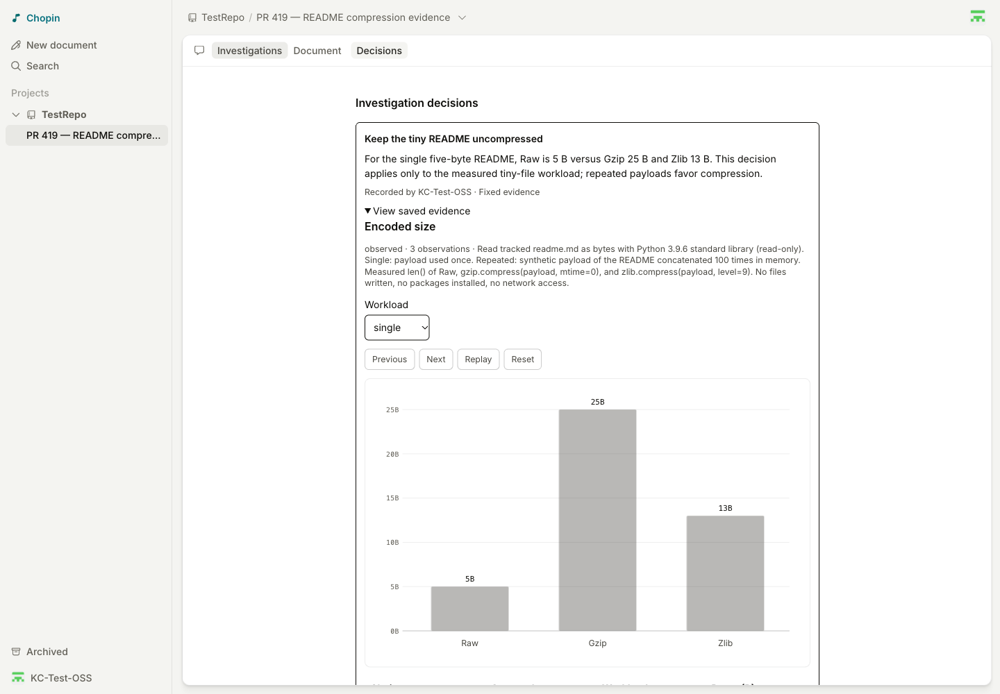
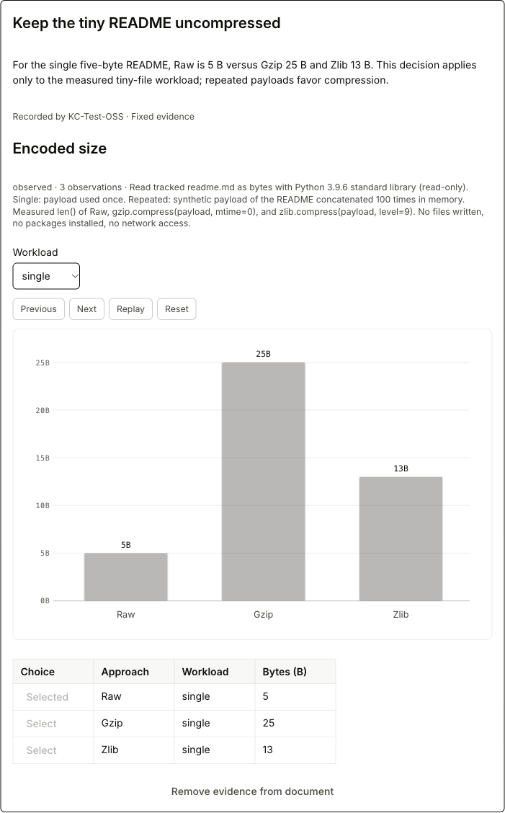
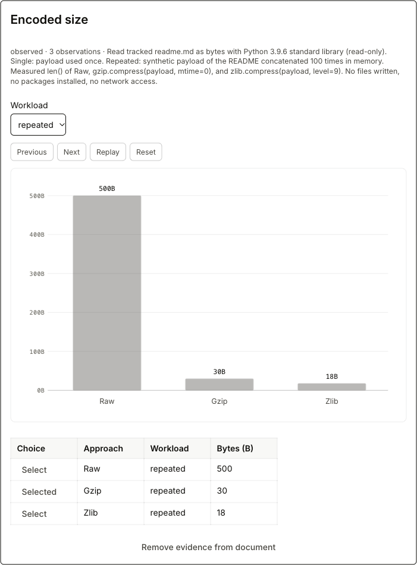

# PR #419: corrected live preview report

**Visual E2E failed: the Investigations dialog is invisible in the tested
deployment. The earlier blanket “passed” assessment is withdrawn.**

- Preview: https://419-chopin.githubnext.com
- Tested deployed head: `cdd50149bb599c718372dc7ba6d9d7f11ce4ddf6`
- Sandbox: `KC-Test-OSS/TestRepo` at `f7aab2fc09f592e231658f91ae4b1c88128563ce`
- [Test document](https://419-chopin.githubnext.com/documents/KC-Test-OSS/TestRepo/pr-419-readme-compression-evidence)
- Successful OpenCode result: `495b71ff-39b2-410e-b573-0e5d649caf74`
- Initial failed Copilot run: `dd54f77b-c57d-4657-972e-0aaf01c20411`
- Test and correction date: 2026-10-09

## Correction: the screenshots exposed a real UI defect

Several earlier screenshots, including those captioned as authorization,
execution, results, and shared selections, actually showed the underlying
document. They did not substantiate their captions and have been removed from
this gallery. I should have reviewed the rendered images before publishing.

The Investigations panel passes `motion={{ phase: "open", className: "" }}` to
`NavigationDialog`. The shared `.motion-modal` CSS defaults to `opacity: 0`;
only `.motion-modal.is-open` makes the dialog opaque. Consequently the panel is
in the accessibility tree and its controls can be exercised by automation,
while a person cannot see the panel. Ordinary Playwright visibility assertions
do not reject opacity-zero elements.

Relevant source:
- `apps/web/src/experiments/panel.tsx`
- `apps/web/src/navigation-dialog.tsx`
- `apps/web/src/navigation.css` (`.motion-modal` / `.motion-modal.is-open`)

A local fix supplies the missing `is-open` class. The regression in
`e2e/experiments.e2e.ts` checks
`element.checkVisibility({ checkOpacity: true })`, including ancestor opacity.
It fails on the deployed source and passes with the fix (the complete targeted
browser test passed). `bun run types` and `bun run ci` also passed. The fix has
not been deployed to the preview; a new live visual check is required after
deployment.

## What the available evidence does establish

- The real OpenCode 2.0.24 ACP run submitted and published a result through the
  generic stdio bridge. The connector log records publication and its detached
  worktree matches the exact sandbox commit. No fixture data was substituted.
- The persisted document contains visible live and fixed evidence cards. These
  are outside the invisible Investigations modal and are shown below.
- The fixed decision contains the single-workload values **5 / 25 / 13 B** and
  the selected Raw row. The live card contains the repeated-workload values
  **500 / 30 / 18 B** and the selected Gzip row.
- Those values match an independent Python check of the five-byte README and a
  payload formed by repeating it 100 times. This is a tiny-file size comparison,
  not a general compression-performance benchmark.
- Programmatic checks exercised shared changes across two tabs, record creation,
  embeddings, reload, and connector disconnect. These remain functional/state
  observations, not proof that the invisible modal is usable by a person.

The three images below were recaptured from the existing deployment and their
saved PNG pixels were reviewed. They show current persisted state, not a replay
of earlier transient running or authorization states. No local CSS fix was
injected into the deployed page to obtain them.

## Reviewed visual evidence

### 1. Bug: clicking Investigations leaves the underlying view visible

The dialog is present in the accessibility tree, but there is no visible modal
or backdrop. This image illustrates the defect; it is not a result-panel pass.

### 2. Visible saved decision and fixed single-workload evidence

The conclusion, disabled single-workload controls, selected Raw row, chart, and
the 5 / 25 / 13 B table are visible in the persisted document card.

### 3. Visible live repeated-workload evidence

The live document card shows the repeated filter, selected Gzip row, chart, and
the different 500 / 30 / 18 B values.

## Other findings and limits

- Copilot rejects ACP-injected stdio MCP servers, tracked in
  [github/copilot-cli#3889](https://github.com/github/copilot-cli/issues/3889).
  Its log states `Rejecting non-http/sse MCP server "acpprobe" from client`.
  The equivalent HTTP probe worked. The initial run used bundled Copilot 1.0.8
  because `--no-auto-update` bypassed its cached 1.0.80; actual 1.0.80 also
  reproduced the stdio limitation.
- SIGINT disconnected the connector and released its lock, but exited with code
  1 and `MCP error -32001: AbortError: The operation was aborted.`
- Two tabs used the same test identity. Cross-owner permissions and server-restart
  persistence were not tested. The connector is stopped, and the test document
  remains available for inspection.
