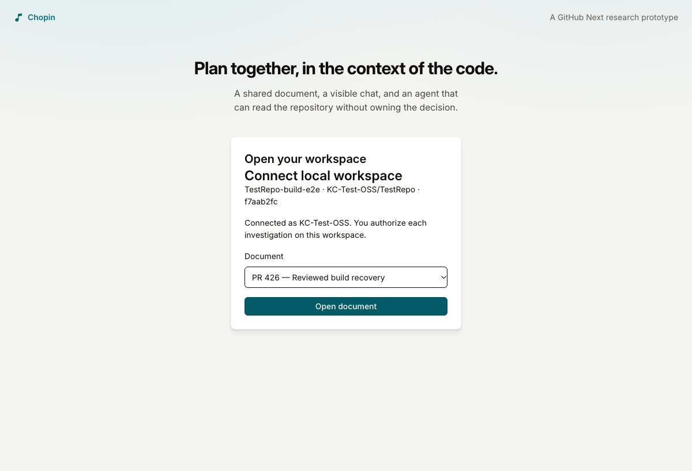
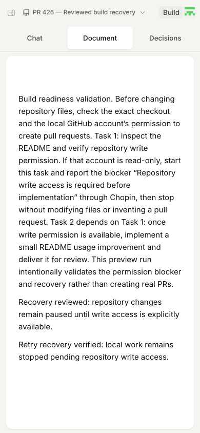
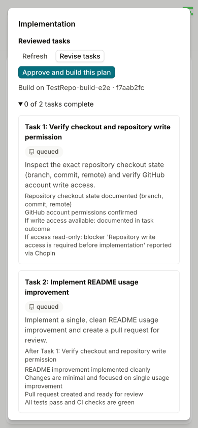
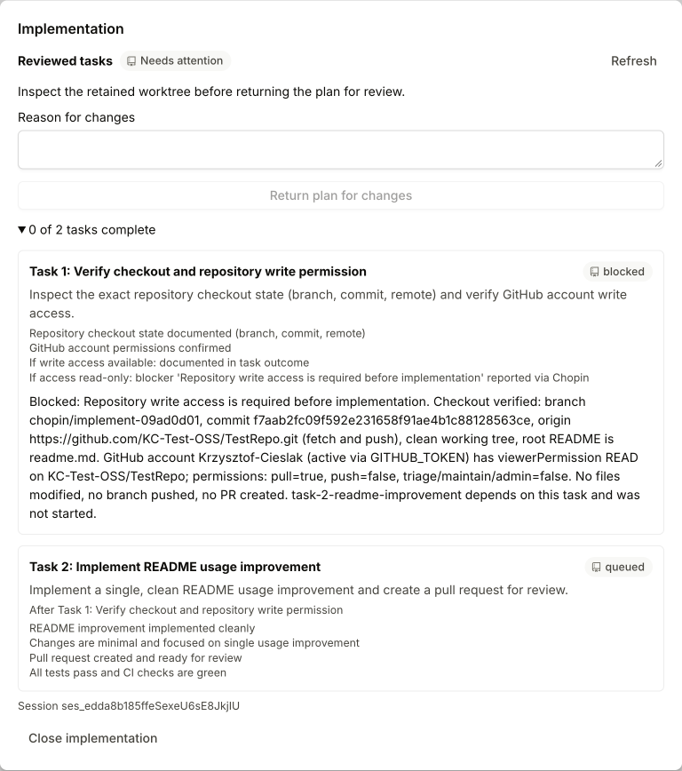
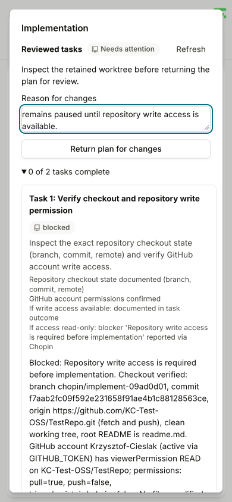
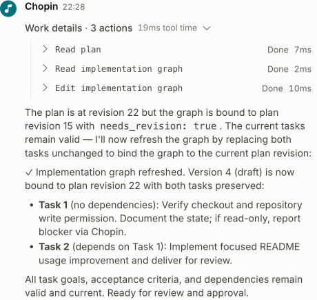
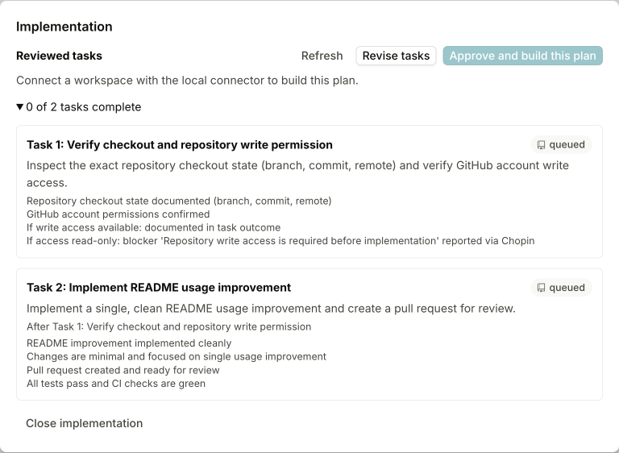
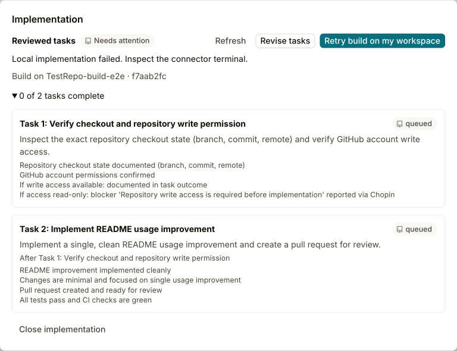

# PR #426: deployed implementation review and recovery

**Passed the agreed current-access workflow:** review a graph, pair a workspace,
approve a real local ACP run, retain its permission blocker, return the plan for
changes, and revise the graph. A controlled failed-start retry also passed.
Actual implementation delivery and multi-PR creation remain unvalidated because
the local coding-agent GitHub identity has read-only sandbox access; the operator
explicitly chose that test scope.

## Deployment and test scope

- PR: https://github.com/githubnext/chopin/pull/426
- Preview: https://426-chopin.githubnext.com
- Final tested head: `d7149821c63e1e29bcbfb2adf46c547ed0cf27c8`
- Final ready confirmation: `2026-10-09T20:22:55Z`, advanced from the recorded
  pre-push timestamp `2026-10-09T20:11:34Z`.
- [Live test document](https://426-chopin.githubnext.com/documents/KC-Test-OSS/TestRepo/pr-426-reviewed-build-recovery)
- Sandbox: `KC-Test-OSS/TestRepo` at `f7aab2fc09f592e231658f91ae4b1c88128563ce`
- Local coding agent: OpenCode through `opencode acp`
- Final real build: `09ad0d01-e0a5-4fa9-8b1d-6c82b5099980`
- [Final-head CI](https://github.com/githubnext/chopin/actions/runs/37986076891):
  all jobs passed: validation/tests, browser integration, and container build.

The final-head run approved work from a 390×844 mobile viewport and rechecked
the retained state on desktop. It reused the settled plan and graph created by
the hosted Planner earlier in this test session. All screenshots below were
reviewed from their saved pixels. The controlled startup-failure image is
explicitly labeled with its earlier revision.

## Design review and fixes

The design fits the merged investigations feature: one owner-paired connector,
shared workspace reservation, exact-commit worktrees, and run-scoped MCP reports.
Implementation approval remains a separate, explicit action against reviewed
document and graph revisions.

The review and live tests produced these fixes:

- Move implementation review behind **Build**, rather than a permanent preface
  that shifts every nonempty document's editor geometry.
- Replace two-second background polling with initial snapshots and committed
  change notifications. Editing locks stay current with the dialog closed.
- Add explicit idempotent retry after failed startup and **Return plan for
  changes** after a claimed run stops. Neither path automatically replays work.
- Wake the connector after durable enqueue; reject duplicate approvals that
  silently change owner or checkout; tolerate deleted documents during recovery.
- Exit cleanly on intentional connector shutdown.
- Make stale graph revisions explicit to the Planner and require Revise tasks
  to create a current draft even when task text is unchanged.
- Keep the same Build action available in the compact/mobile header.

The last two issues were found by the live preview test, fixed, deployed, and
retested. Coworker rebases were preserved; range-diff verified the implementation
fixes survived the upstream updates.

## 1. Pair the real connector

```sh
CHOPIN_URL=https://426-chopin.githubnext.com \
  bun run connector connect /path/to/TestRepo-build-e2e -- opencode acp
```

The browser paired the local checkout to the test document. Each new build still
required owner authorization.



## 2. Review and approve from mobile

The document remains readable without an implementation preface, and Build is
visible in the compact header.



The review contains the exact workspace revision, task goals, acceptance
criteria, and dependency. The first task checks checkout and write permission;
the second must wait for it. Approval was clicked once from this mobile view.



## 3. Real ACP execution and the expected permission blocker

The connector claimed the reviewed graph, created an exact-commit worktree,
and prompted OpenCode. The agent checked the actual checkout and local GitHub
permissions, started the preflight task, and reported the expected blocker:
**Repository write access is required before implementation.** The dependent
task remained queued. No result or PR URL was fabricated.

The blocker and session identity persisted after reload. Editing stayed locked
while the dialog was closed. The final real run's worktree was clean and its HEAD
matched the sandbox commit above.



## 4. Return for changes, edit, and revise

After the connector stopped cleanly, the browser submitted a reason through
Return plan for changes from the mobile dialog. Editing unlocked, a new recovery
paragraph was accepted, and the text survived reload.



That edit made the old graph stale and prevented another build. Revise tasks
then invoked `read_plan`, `read_implementation_graph`, and
`edit_implementation_graph`. The Planner created draft graph version 4, bound to
document revision 22, preserving the two tasks and their dependency.



The final review is ready for a new human decision. Approval is disabled because
no local workspace is connected; no new build started automatically.



## 5. Controlled failed-start retry

This case ran on the implementation-equivalent earlier revision `b7924f6e`,
before the compact-header-only fix. For fault injection, the connector's ACP
command was temporarily `/usr/bin/false`.

- Build `6d089aec-0d73-4929-8e21-de9dcd9f110f` failed before any agent session or
  task started. The document stayed editable and the failure survived reload.
- Retry build on my workspace appeared. There was no automatic restart.
- After reconnecting OpenCode, one explicit retry created new build
  `52b522e0-561b-4229-a586-c38229d0204a`, which ran the real permission preflight
  and reported the expected blocker. Its dependent task remained queued.
- Recovery after disconnect restored editing again.



## Validation and limitations

- The former CI failures in keyboard viewport layout and comment-marker geometry,
  plus the focus-restoration case, passed locally after the UI change.
- Scripted browser tests cover both MCP transports, successful reporting of two
  PRs and graph verification, failed startup retry, lock restoration on reload,
  and return-for-changes. Those PRs are fixtures, not real GitHub PRs.
- The final local targeted browser run passed seven tests with one opt-in live
  test skipped. Graph/tool follow-up tests passed 38 tests. Types and repository
  CI checks passed.
- Earlier full unit validation passed 4,294 tests with four skips; subsequent
  upstream updates and final CI are identified by the linked run above.
- All local connectors are stopped and their locks are released. Supplied and
  execution worktrees are clean. The test document remains available for review.
- Actual PR creation, full implementation delivery, parallel sub-agent delivery,
  and a second user's approval boundaries were not tested in the live sandbox.
- Browser authorization and local GitHub authorization remain distinct: the
  paired browser owner could approve, while the local coding agent correctly
  stopped at its own read-only repository permission.
