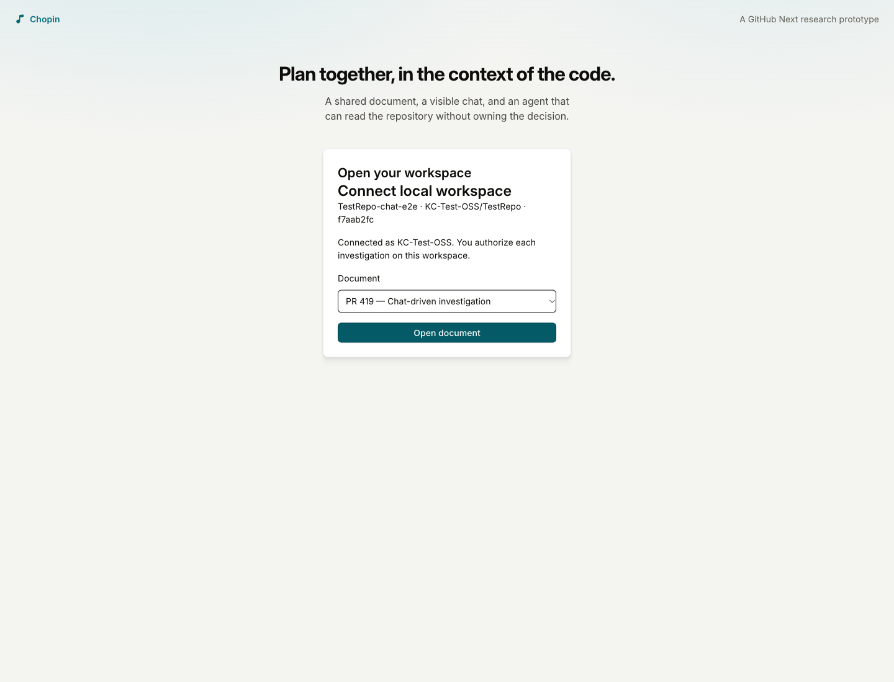
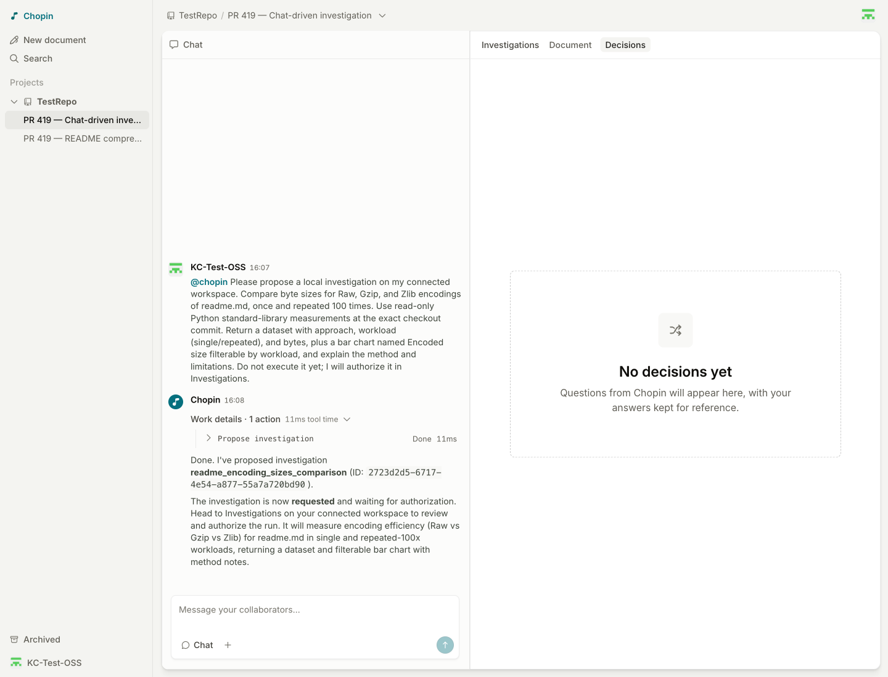
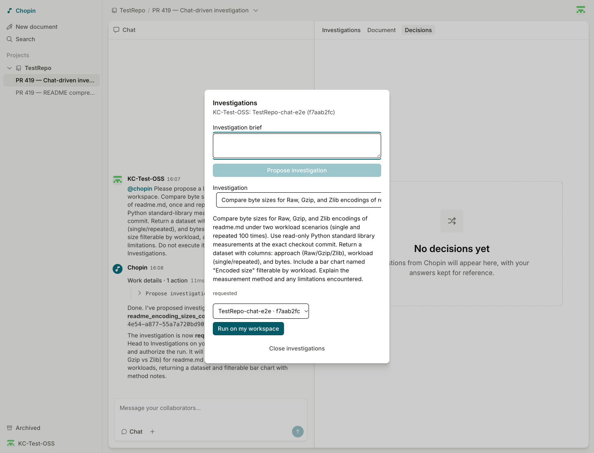
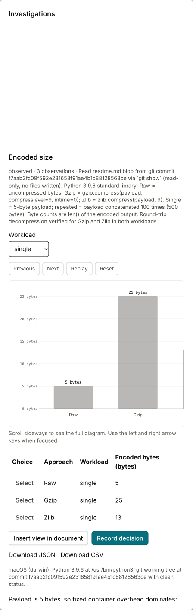
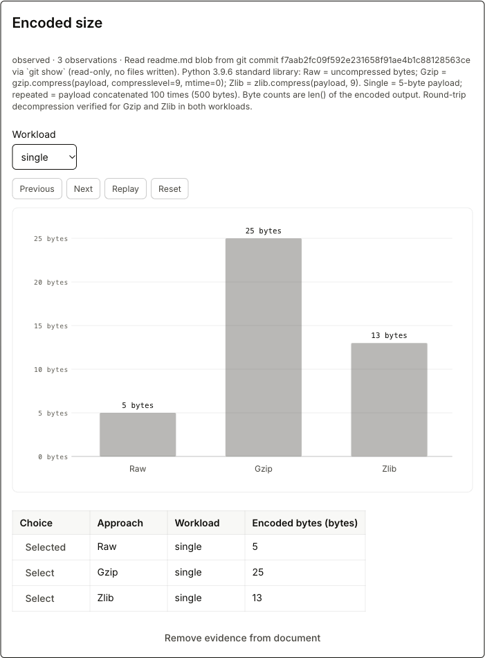
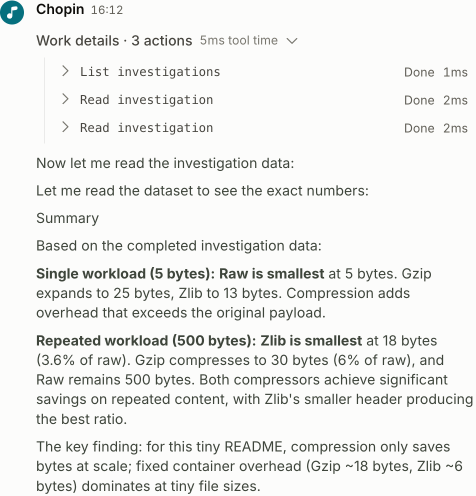
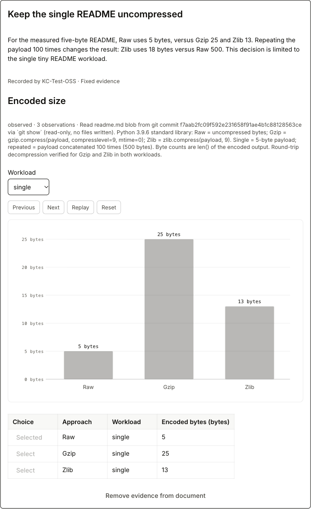
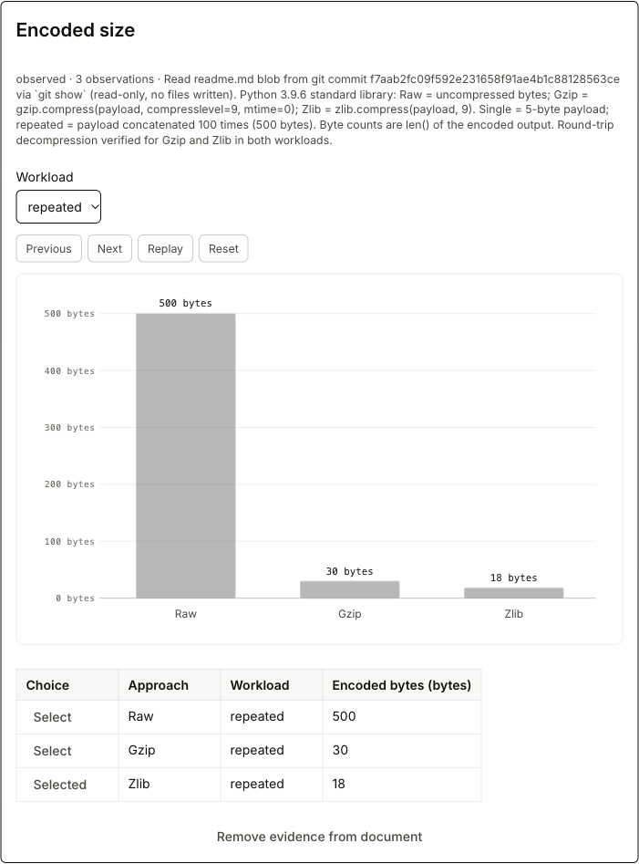

# PR #419: fresh Chat-to-investigation E2E report

**Passed on the newly deployed visibility fix.** This is a fresh document and
investigation, created through Chat after deployment. Each published screenshot
was reviewed from its saved pixels; the Investigations modal is visibly painted.

## Deployment and test identity

- Preview: https://419-chopin.githubnext.com
- Deployed/tested commit: `9785424c6ad2beb4b7ffce05e1002facd84c3c08`
- Trusted preview-ready comment advanced from `2026-10-09T12:11:28Z` before the
  single push to `2026-10-09T14:05:48Z` afterward.
- [CI run 37940125533](https://github.com/githubnext/chopin/actions/runs/37940125533):
  validation/tests, browser integration, and container build all passed.
- [Fresh test document](https://419-chopin.githubnext.com/documents/KC-Test-OSS/TestRepo/pr-419-chat-driven-investigation)
- Investigation: `2723d2d5-6717-4e54-a877-55a7a720bd90`
- Sandbox source: `KC-Test-OSS/TestRepo` at `f7aab2fc09f592e231658f91ae4b1c88128563ce`
- Local coding agent: OpenCode `2.0.24`, launched through `opencode acp`
- Test date: 2026-10-09

The former invisible-dialog defect was fixed by supplying the missing
`is-open` class. Its browser regression checks ancestor opacity with
`checkVisibility({ checkOpacity: true })`; it failed before the fix and passed
afterward. A fresh preview screenshot also confirmed the modal and backdrop
were painted before this workflow began.

## 1. Connect the real local workspace

The connector ran against a disposable, exact-commit sandbox worktree:

```sh
CHOPIN_URL=https://419-chopin.githubnext.com \
  bun run connector connect /path/to/TestRepo-chat-e2e -- opencode acp
```

The browser paired it with the fresh document. The captured completion state
shows the workspace, source commit, selected document, and Open document link.



## 2. Request the investigation through Chat

The user message addressed `@chopin` and asked for a read-only comparison of Raw,
Gzip, and Zlib byte sizes for the README, once and repeated 100 times. It requested
a dataset, a workload-filtered chart, method, and limitations.

The hosted Planner called **propose_investigation** and returned the new request
ID. The Investigations proposal form was not used to create this request.



## 3. Explicitly authorize local execution

The visible Investigations dialog showed the Chat-created request as
**requested** with **Run on my workspace**. The local connector log was still
idle and there was no run journal/worktree before that button was clicked.



After one authorization click, the connector created the exact-commit run
worktree, executed the real OpenCode ACP turn, and published its submitted result:

```text
Connected. Waiting for owner-authorized investigations.
Running 2723d2d5-6717-4e54-a877-55a7a720bd90
Published 2723d2d5-6717-4e54-a877-55a7a720bd90
```

## 4. Inspect returned results in Investigations

The result contained a native chart and typed table. All six values matched an
independent Python standard-library measurement:

| Workload | Raw | Gzip | Zlib |
| --- | ---: | ---: | ---: |
| Single five-byte README | 5 B | 25 B | 13 B |
| README repeated 100 times | 500 B | 30 B | 18 B |

The following capture shows the single-workload result inside Investigations,
including the complete numeric table and insert/record actions. The chart has a
horizontal scroller in the narrow dialog; the document embed below shows all
three bars at once.



Two browser tabs using the same account synchronized workload changes in both
directions and the selected Raw row. These were real shared-state interactions,
not separate copies of a fixture.

## 5. Embed the live result in the document

**Insert view in document** inserted one live evidence card. The single workload
and Raw selection were visible in the document, with all three bars and rows.



## 6. Ask Chat to read the captured evidence

A follow-up `@chopin` message asked which encoding was smallest in each workload.
The Planner used **list_investigations** and **read_investigation**, then correctly
reported Raw at 5 B for the single README and Zlib at 18 B for the repeated
payload. It did not create another investigation or edit the document.



## 7. Save and embed a fixed decision

With the acknowledged single-workload filter and Raw selection, **Record
decision** saved **Keep the single README uncompressed**, along with its measured
rationale. The record appeared in Decisions. **Insert decision evidence in
document** added its fixed snapshot alongside the live card.

After changing the live view to repeated/Zlib, the saved decision still showed
single/Raw and 5 / 25 / 13 B with disabled controls. This capture was taken after
reload and connector disconnect, not while the save operation was transiently
in progress.



## 8. Verify persistence and collaboration without the connector

Both tabs were reloaded after the connector stopped. Chat history, the published
result, the saved decision, and both document embeds remained. Changing the live
workload in one tab still updated the other tab while no local agent was
connected. The saved snapshot remained fixed throughout.

The final live card shows the different repeated-workload values and Zlib
selection. Its 500 / 30 / 18 B values deliberately differ from the fixed card's
5 / 25 / 13 B values above.



The connector is stopped and its local lock was released. The supplied sandbox
worktree and the execution worktree were clean, and the execution HEAD matched
the source commit listed above. The test document remains available for review.

## Remaining findings and scope

- SIGINT completes disconnect/lock cleanup but the connector still exits with
  code 1 and `MCP error -32001: AbortError: The operation was aborted.`
- Long investigation labels are clipped by the narrow selector. The result
  chart also uses a horizontal scroller in that dialog; its numeric table and
  full-width document embeds remain readable.
- This successful run used OpenCode. The previously diagnosed
  [Copilot stdio-injection limitation](https://github.com/github/copilot-cli/issues/3889)
  remains; this was not a Copilot retest.
- Collaboration used two tabs under one test identity. Cross-owner authorization
  and server-restart persistence were not tested; owner approval, browser reload,
  and local-connector disconnect were.
- The prior report's visual-pass claim was withdrawn. The
  [corrected pre-fix report](https://github.com/githubnext/chopin/tree/b9d30726b88e813e05dbfa3e4cc6568ee10c7776)
  is preserved in history. All eight images in this report are from the new,
  post-deployment workflow and were individually inspected before publication.
