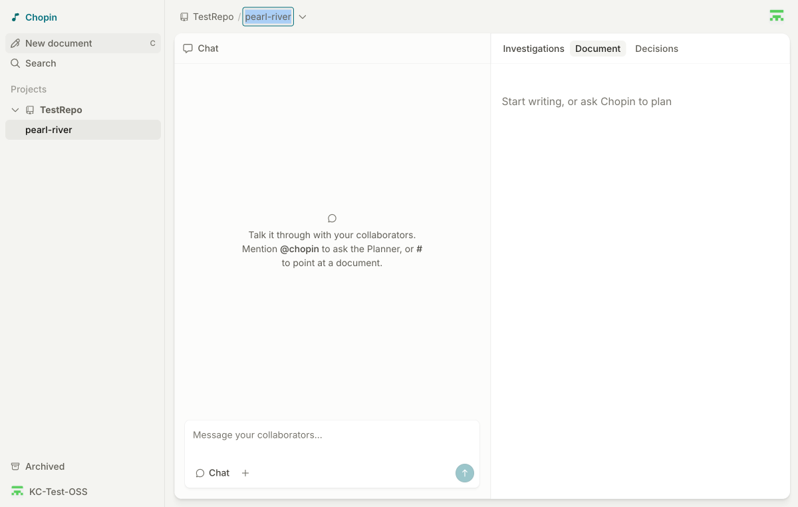
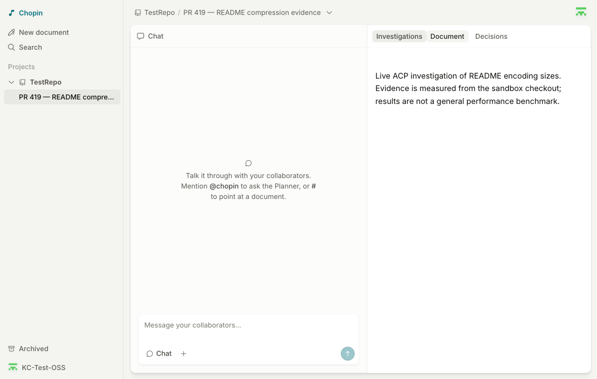

# PR #419: live preview E2E report

**Result: blocked at the real ACP-to-MCP handoff.**

- Date: 2026-10-09
- PR: https://github.com/githubnext/chopin/pull/419
- Preview: https://419-chopin.githubnext.com
- Reviewed and operator-attested deployed head: `cdd50149bb599c718372dc7ba6d9d7f11ce4ddf6`
- Sandbox: `KC-Test-OSS/TestRepo`
- Exact sandbox revision: `f7aab2fc09f592e231658f91ae4b1c88128563ce`
- Test document: https://419-chopin.githubnext.com/documents/KC-Test-OSS/TestRepo/pr-419-readme-compression-evidence
- Failed investigation: `dd54f77b-c57d-4657-972e-0aaf01c20411`
- Real coding agent: GitHub Copilot CLI `1.0.80`, via ACP

## Passed

1. Real GitHub authentication, including operator-completed device verification;
   secret-name substitution and account identity checks succeeded.
2. Exactly one repository matched the configured sandbox. The current Add project
   UI has no capability subtitle; write access was verified using its guarded
   document-creation control and successful creation of a new test document.
3. The real local connector paired with that document through the browser.
4. A proposed investigation remained idle until **Run on my workspace** was clicked.
   The connector had no run journal/worktree before authorization.
5. Authorization started one real ACP turn in a new detached worktree at the exact
   requested sandbox commit. Both the supplied and run worktrees remained clean.
6. Completion without submitted evidence was rejected with `missing-result`;
   the browser displayed a terminal failure and published no result.
7. The failure persisted across reload, without automatically restarting work.
8. **Propose retry** created a new proposal requiring fresh owner authorization.
   The retry was deliberately left unexecuted.
9. Stopping the connector made the workspace unavailable for execution. The failed
   investigation and retry proposal persisted after another reload.

## Blocking finding: the real agent did not receive the investigation tools

The connector created the worktree and the Copilot turn completed, but Copilot
reported that `read_investigation` and `submit_investigation_result` were absent
from its tool set. Its session history contains no tool calls. The subsequent
`complete_experiment` call was correctly rejected:

```text
Running dd54f77b-c57d-4657-972e-0aaf01c20411
[{"type":"text","text":"missing-result: missing-result"}]
```

The live command used the documented connector entrypoint, `copilot --acp
--no-auto-update`, and explicit non-interactive approvals for the
`chopin-investigation` MCP server and the required read-only Python/Git commands.

Narrow follow-up probes:

- A real Copilot ACP session with a minimal injected stdio `probe_echo` MCP tool
  also reported the tool unavailable. A startup marker confirmed that the supplied
  MCP server process was never launched.
- A separate OpenCode `2.0.24` ACP probe also reported the injected tool unavailable.
  This was a local diagnostic, not a second deployed investigation.
- A protocol spy confirmed that the shared client actually sends protocol version
  1, followed by `session/new` with `cwd` and the stdio `mcpServers` configuration.

This establishes a reproducible integration blocker in the tested environment,
not yet its precise cause. Investigate the real agents' handling of `session/new`
MCP configuration and add a real-tool handshake check before relying on the
current ACP smoke test. The existing opt-in smoke test asks for a text response
without tools, so it does not exercise this boundary.

Relevant code: `apps/connector/src/acp.ts` (session setup/prompt),
`apps/connector/src/main.ts` (bridge injection/completion), and
`apps/connector/src/acp.test.ts` (current real-agent smoke test).

## Not verified on the deployed application

The real run produced no result, so native result tables/charts, collaborative
filtering and row selection, saved decisions, evidence embeds, and persistence
of successfully published evidence remain unverified. No fixture result was
substituted for the failed real-agent run. Cross-owner authorization was not
tested with a second identity.

## Other observations

- SIGINT disconnected the workspace and released the local lock, but the connector
  exited with status 1 and `MCP error -32001: AbortError: The operation was aborted.`
- The preview-testing instructions were stale relative to the current Add project
  UI. The local skill was updated to use the actual guarded creation controls.
- Playwright's explicit relative screenshot filenames were written relative to the
  checkout, despite `--output-dir`. The nine generated PNGs were moved to external
  artifact storage before publication; no authentication pages were captured.

## Screenshots

### 1. Configured sandbox



### 2. New test document


### 3. Real connector pairing


### 4. Proposal awaiting owner authorization


### 5. Authorized execution


### 6. Terminal missing-result failure


### 7. Failure after reload


### 8. Explicit retry awaits authorization


### 9. Disconnected workspace and persistent state


