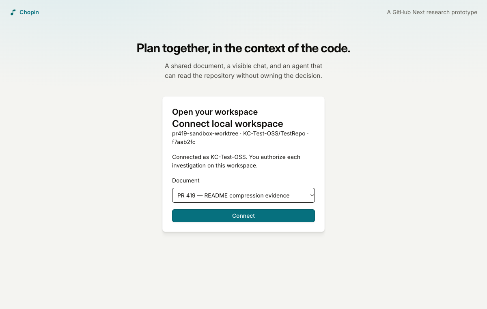
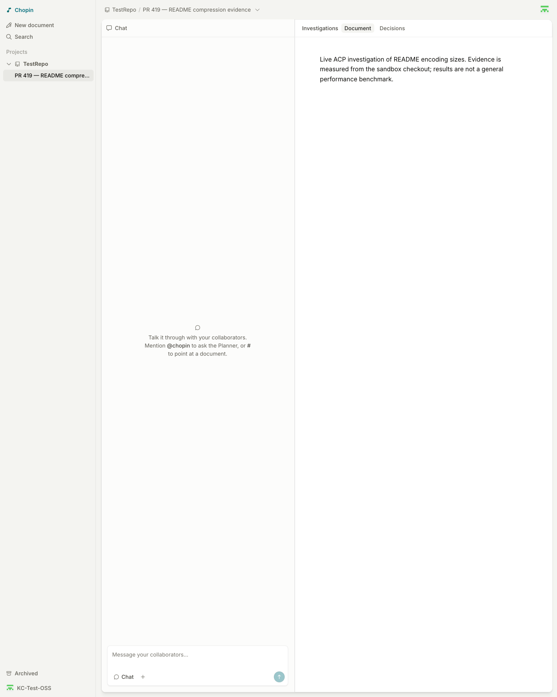
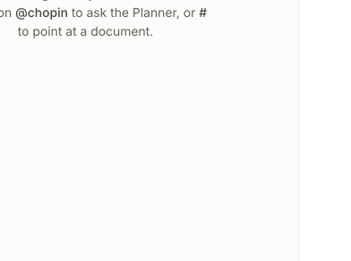
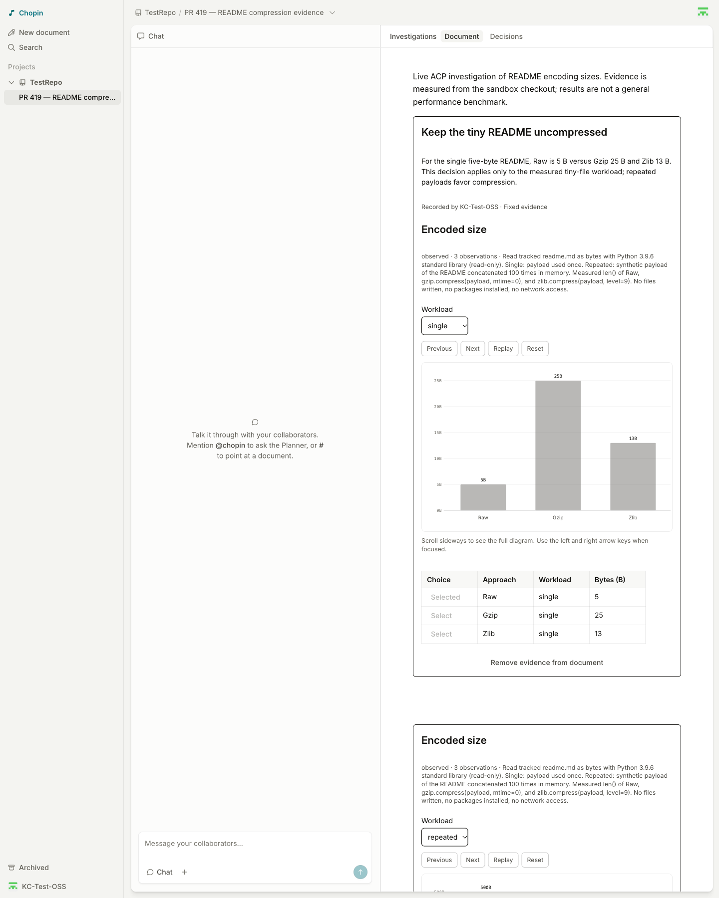
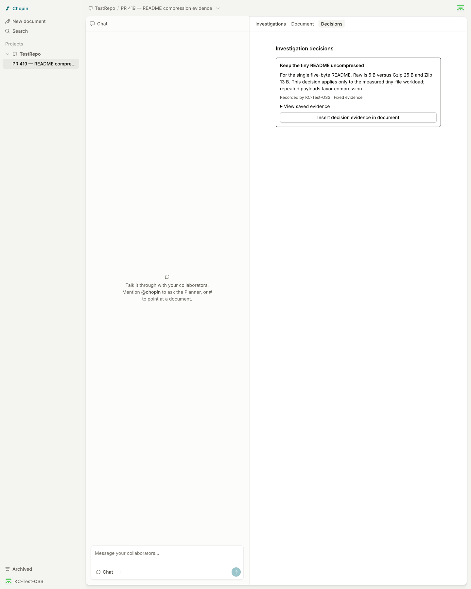
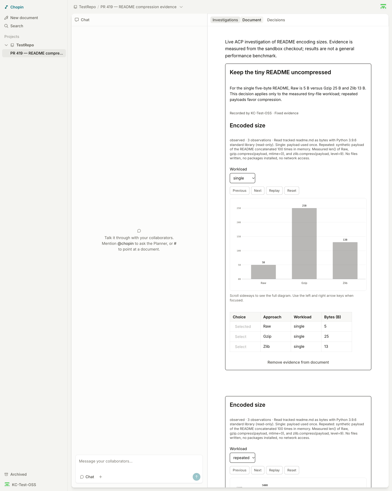

# PR #419: live preview E2E report

**Result: the requested live investigation/evidence flow passed with OpenCode ACP
2.0.24. Copilot's stdio-injection incompatibility remains documented below.**

- Date: 2026-10-09
- PR: https://github.com/githubnext/chopin/pull/419
- Preview: https://419-chopin.githubnext.com
- Reviewed and operator-attested deployed head: `cdd50149bb599c718372dc7ba6d9d7f11ce4ddf6`
- Sandbox: `KC-Test-OSS/TestRepo`
- Exact sandbox revision: `f7aab2fc09f592e231658f91ae4b1c88128563ce`
- Test document: https://419-chopin.githubnext.com/documents/KC-Test-OSS/TestRepo/pr-419-readme-compression-evidence
- Successful OpenCode investigation: `495b71ff-39b2-410e-b573-0e5d649caf74`
- Failed investigation: `dd54f77b-c57d-4657-972e-0aaf01c20411`
- Initial coding agent: GitHub Copilot CLI `1.0.8`, via ACP. The launcher reported
  `1.0.80` for `copilot --version`, but the test's `--no-auto-update` flag selected
  its bundled `1.0.8` executable. Follow-up tests also reproduced the stdio
  limitation on actual `1.0.80`.

## OpenCode follow-up: passed

The same deployed application and generic connector were used with:

```sh
CHOPIN_URL=https://419-chopin.githubnext.com \
  bun run connector connect /path/to/sandbox-worktree -- opencode acp
```

No harness-specific connector adapter or fabricated result was used. A real-tool
probe first confirmed that OpenCode could discover and call the supplied stdio
MCP server. The browser then paired the new connector and explicitly authorized
the pending retry.

1. The real OpenCode ACP turn completed and the connector published its submitted
   result. The detached run worktree matched the exact sandbox revision above.
2. Native chart and table rendering showed all six expected measured values:

   | Workload | Raw | Gzip | Zlib |
   | --- | ---: | ---: | ---: |
   | Single five-byte README | 5 B | 25 B | 13 B |
   | README repeated 100 times | 500 B | 30 B | 18 B |

   These matched an independent Python standard-library check. They are tiny-file
   size measurements, not a general compression-performance benchmark.
3. Two tabs using the same authenticated test account synchronized workload filters
   in both directions and the selected Raw row.
4. The decision **Keep the tiny README uncompressed** saved the acknowledged
   single-workload evidence and selection. Changing the live view to the repeated
   workload and Gzip selection left the saved evidence unchanged and read-only.
5. A saved-decision embed and a live-view embed were inserted into the document.
   The live embed followed changes from the other tab; the saved embed retained
   the original single-workload values. The decision appeared in Decisions.
6. Both embeds and the decision survived a document reload.
7. After stopping the connector, the published result, decision, and both embeds
   survived another reload. Live filters still synchronized between tabs with
   no local agent connected, while the saved snapshot remained immutable.

The connector was stopped after the test. The supplied sandbox worktree and the
successful run worktree were both clean. The document and its evidence remain
available for inspection.

## Initial Copilot attempt: passed checks

1. Real GitHub authentication, including operator-completed device verification;
   secret-name substitution and account identity checks succeeded.
2. Exactly one repository matched the configured sandbox. The current Add project
   UI has no capability subtitle; write access was verified using its guarded
   document-creation control and successful creation of a new test document.
3. The real local connector paired with that document through the browser.
4. A proposed investigation remained idle until **Run on my workspace** was clicked.
   The connector had no run journal/worktree before authorization.
5. Authorization started one real ACP turn in a new detached worktree at the exact
   requested sandbox commit. Both the supplied and run worktrees remained clean.
6. Completion without submitted evidence was rejected with `missing-result`;
   the browser displayed a terminal failure and published no result.
7. The failure persisted across reload, without automatically restarting work.
8. **Propose retry** created a new proposal requiring fresh owner authorization.
   The retry was deliberately left unexecuted.
9. Stopping the connector made the workspace unavailable for execution. The failed
   investigation and retry proposal persisted after another reload.

## Copilot compatibility blocker: missing investigation tools

The connector created the worktree and the Copilot turn completed, but Copilot
reported that `read_investigation` and `submit_investigation_result` were absent
from its tool set. Its session history contains no tool calls. The subsequent
`complete_experiment` call was correctly rejected:

```text
Running dd54f77b-c57d-4657-972e-0aaf01c20411
[{"type":"text","text":"missing-result: missing-result"}]
```

The live command used the documented connector entrypoint, `copilot --acp
--no-auto-update`, and explicit non-interactive approvals for the
`chopin-investigation` MCP server and the required read-only Python/Git commands.

Narrow follow-up probes:

- Real Copilot ACP sessions on both `1.0.8` and `1.0.80` with a minimal injected
  stdio `probe_echo` MCP tool reported the tool unavailable. A dependency-free
  server and startup marker confirmed that the supplied server was never launched.
- Copilot `1.0.80` logged the exact cause:
  `Rejecting non-http/sse MCP server "acpprobe" from client`.
- The same `probe_echo` tool supplied over HTTP worked on Copilot `1.0.80`:
  `initialize`, `notifications/initialized`, `tools/list`, and `tools/call` all
  reached the bridge, and the model returned `ACP_MCP_PROBE_OK`.
- The earlier inline OpenCode probe was inconclusive. A subsequent
  dependency-free stdio control started and received `tools/list`; it should not
  be treated as evidence of the Copilot-specific rejection.
- A protocol spy confirmed that the shared client actually sends protocol version
  1, followed by `session/new` with `cwd` and the stdio `mcpServers` configuration.

The cause is confirmed and tracked upstream in
[github/copilot-cli#3889](https://github.com/github/copilot-cli/issues/3889):
Copilot rejects client-supplied stdio MCP servers in ACP `session/new` even though
it returns a successful session response. Upgrading from the stale executable
alone does not resolve this limitation.

The generic connector fix is capability-based transport selection: provide a
run-scoped HTTP bridge when the agent advertises `mcpCapabilities.http`, and use
stdio for other agents. This needs no Copilot-specific adapter. Add a real-tool
handshake check: the existing opt-in smoke test asks for a text response without
tools, so it does not exercise this boundary. The full deployed investigation
has not yet been rerun with an HTTP bridge.

Relevant code: `apps/connector/src/acp.ts` (session setup/prompt),
`apps/connector/src/main.ts` (bridge injection/completion), and
`apps/connector/src/acp.test.ts` (current real-agent smoke test).

## Coverage limits

Cross-owner authorization was not tested with a second identity. Cross-client
collaboration was exercised using two tabs under the same test account. The
successful data/evidence flow was verified with OpenCode; a full Copilot run
using an HTTP bridge was not implemented or tested. Server-restart persistence
was not part of this test; browser reload and local-connector disconnect were.

## Other observations

- SIGINT disconnected the workspace and released the local lock, but the connector
  exited with status 1 and `MCP error -32001: AbortError: The operation was aborted.`
- The preview-testing instructions were stale relative to the current Add project
  UI. The local skill was updated to use the actual guarded creation controls.
- Playwright's explicit relative screenshot filenames were written relative to the
  checkout, despite `--output-dir`. The nine generated PNGs were moved to external
  artifact storage before publication. Subsequent screenshots used absolute paths
  under the configured output directory. No authentication pages were captured.

## Screenshots

### 1. Configured sandbox


### 2. New test document


### 3. Real connector pairing


### 4. Proposal awaiting owner authorization


### 5. Authorized execution


### 6. Terminal missing-result failure


### 7. Failure after reload


### 8. Explicit retry awaits authorization


### 9. Disconnected workspace and persistent state


### 10. OpenCode connector pairing



### 11. OpenCode authorized execution


### 12. Real published measurements


### 13. Cross-tab shared selection



### 14. Saved evidence-backed decision



### 15. Fixed evidence after changing the live view


### 16. Live and saved document embeds



### 17. Decision in the Decisions surface



### 18. Embeds after reload


### 19. Published evidence after connector disconnect



### 20. Collaborative evidence without a local agent


