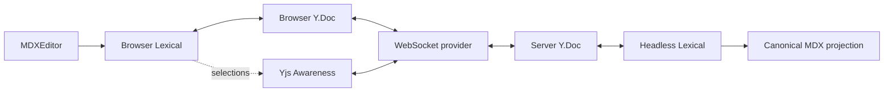
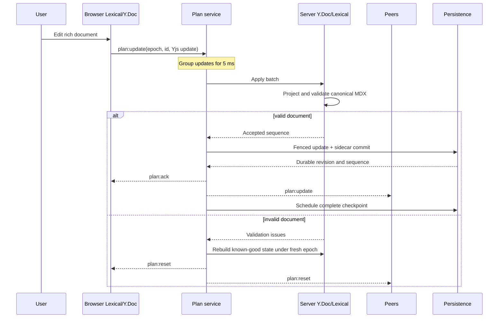
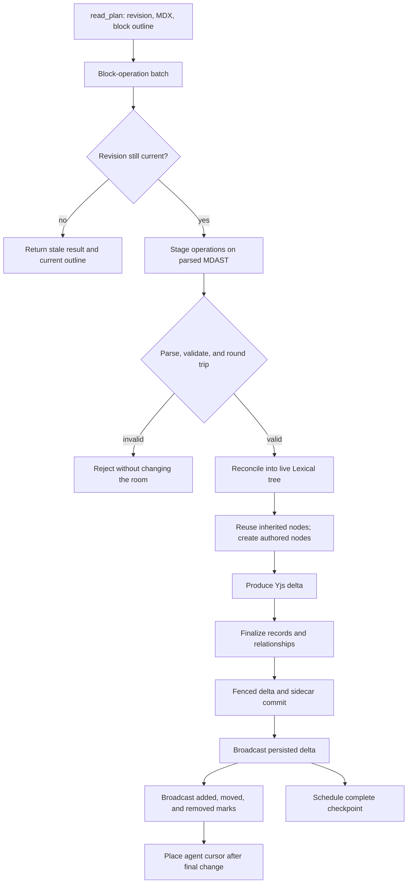

# Document architecture

Chopin represents one plan in three forms: Lexical for rich editing, Yjs for
live collaboration, and canonical MDX for a readable durable projection. These
are not competing sources of truth. While a channel is open, the
server's Yjs document and its headless Lexical mirror are authoritative.

## Hard requirements

- Several people can edit one rich document with live cursors and selections.
- The editor supports the restricted MDX dialect, including its structured
  widgets, rather than exposing only Markdown source.
- Agent edits appear in the same live document as ordinary edits.
- Readers see what the agent just added, moved, or removed, and an agent cursor
  marks where its latest edit finished.
- Unrelated agent edits preserve existing selections, cursors, and undo history.
- Every accepted document state passes server-side dialect validation.
- Questions and accepted comments remain durable decisions that plan prose
  cannot silently rewrite.
- Links from questions and comments to plan prose survive nearby edits and fail
  conservatively when their target can no longer be identified.
- The durable plan remains readable and diffable as MDX.

## In-memory representation

The browser mounts MDXEditor, whose document and selection engine is Lexical. A
custom collaboration plugin binds that Lexical editor to a browser Y.Doc with
`@lexical/yjs`. Yjs Awareness carries ephemeral cursor and selection presence.

The server owns the authoritative Y.Doc for each open room. A headless Lexical
editor is bound to it so the server can interpret CRDT updates, validate the
resulting tree, and project canonical MDX without relying on a connected
browser.

The channel room also holds state that is not document content: revision and sequence
counters, presence, question records and drafts, comment threads, transcript,
agent state, pending client batches, and its persistence coordinator. Channels
persist agent ownership and reconstruct a disposable SDK session from durable
context.

## Human CRDT flow

1. A browser edit updates Lexical and `@lexical/yjs` produces a Yjs update.
2. The provider retains the update until the server acknowledges it and replays
   unacknowledged updates after a reconnect.
3. The server groups client updates for 5 ms and applies the batch to its Y.Doc.
4. The headless Lexical mirror catches up and is projected to canonical MDX.
5. The merged Yjs update and current sidecar are committed under the writer
   fence before acknowledgement or relay.
6. The accepted state becomes the latest known-good rebuild point and a
   checkpoint is scheduled.
7. A batch that leaves the document invalid cannot be undone in Yjs. The room
   is rebuilt from its last known-good state under a fresh epoch and clients
   reopen it.

Awareness follows a separate, ephemeral path. It is relayed for live presence
but is never part of the persisted plan.

## Agent edit flow

The agent reads canonical MDX, the current revision, and an outline of
addressable top-level blocks. It edits through `edit_plan`, whose block
operations are resolved against that revision.

1. Operations are staged against the parsed MDAST without touching the room.
2. Inserted or replacement MDX fragments are parsed, restricted components are
   refused, and missing component IDs are minted by the server.
3. The assembled document is serialized, parsed again, dialect-validated, and
   proven to survive a Lexical import/export round trip.
4. Existing MDAST objects identify untouched or moved blocks. Their live
   Lexical nodes are reused; only genuinely new blocks are constructed.
5. Lexical produces a Yjs delta. The server finalizes detached records,
   rebases and reviews relationships, and attributes accepted-comment results.
6. The channel commits that delta and finalized sidecar before broadcasting it.
   The server then derives change marks and places the agent cursor at the end
   of the final changed block.

The Yjs update is broadcast before the change description, so every browser has
the nodes an agent mark names before it tries to draw that mark.

## Anchors and decisions

An anchor is a server-minted reference from durable sidecar state to one
top-level block in the plan. It lets the interface answer "where does this
decision live?": hovering can highlight the prose, and clicking can scroll to
it. A relationship can contain several anchors when a decision produced several
blocks.

An anchor is not a block index or a Lexical node key. Indices change whenever
content is inserted above them, and Lexical keys exist only inside one editor.
Instead, a durable block anchor combines a Yjs relative position with a digest
of the canonical block. The position survives edits around the block. The
digest can recover a uniquely matching block after a move or epoch change; an
ambiguous or missing match is orphaned rather than guessed.

Each answered question has one relationship to the blocks whose prose embodies
that decision. A comment thread has two different relationships: its subject is
the phrase the room discussed, while its result is the blocks produced after
the room accepted the comment. The result may be empty when the decision was
reviewed and deliberately produced no plan content.

A comment passage adds relative text positions, the quoted text, and its prior
offset. Positions let the range move with ordinary text edits, while the quote
is a fallback when those positions no longer resolve.

Question answers and accepted comment threads are owned by records outside the
document. Their `<Questionnaire>` and `<Decision>` nodes are readable
projections in MDX. Domain operations update the record and projection together;
ordinary plan edits may not author or rewrite them.

## Persistence

Channels persist through `StorageAdapter.collaboration`:

- a complete Yjs checkpoint with its epoch, canonical MDX and source hash;
- a post-checkpoint journal of accepted Yjs updates;
- a versioned sidecar containing plan counters, question records and live draft
  CRDTs, comment threads, transcript, and relationships; and
- first-invoker agent ownership in the separate `agent_state` record.

The fenced collaboration commit completes before a client update is
acknowledged or a server-authored update is broadcast. Checkpointing later folds
the journal into a complete Yjs state and removes journal entries through that
sequence. Recovery validates that checkpoint bytes project to the stored MDX,
replays the ordered journal, and preserves the epoch. Awareness remains
ephemeral. Copilot SDK session IDs are deliberately not persisted; a new
session receives durable transcript context and reads the current plan.

## Why block operations

The operation DSL is more than a way to modify text. It is explicit provenance
for an agent edit:

- The revision makes a stale batch fail atomically.
- Operations identify insertion, replacement, movement, and deletion directly.
- Retained MDAST object identity says exactly which Lexical nodes are unchanged.
- Fresh objects say which blocks the agent authored.
- Move and removal metadata drives accurate highlights without treating every
  block shifted by an insertion as changed.
- Authored blocks support accepted-comment attribution and agent cursor
  placement.
- Staging provides one place to enforce component identity and protect
  record-owned projections.

An MDX patch would be familiar to an agent, but after applying it the server
would have to reconstruct the same provenance with a structural diff. Moves,
rewrites, and repeated identical blocks make that inference ambiguous. Because
agent presence, anchor stability, and unaffected Lexical identity are hard
requirements, the explicit block-operation DSL is the more reliable boundary.

## Main implementation points

- Browser binding: `packages/editor/src/collaboration.tsx`
- Server document: `apps/server/src/plan/room.ts`
- CRDT service: `apps/server/src/plan/service.ts`
- Agent tools and operations: `apps/server/src/agent/tools.ts` and
  `apps/server/src/plan/edit.ts`
- Persistence coordinator: `apps/server/src/plan/service.ts`
- Storage contract: `apps/server/src/storage/port.ts`
- PostgreSQL adapter: `apps/server/src/storage/postgres/adapter.ts`
