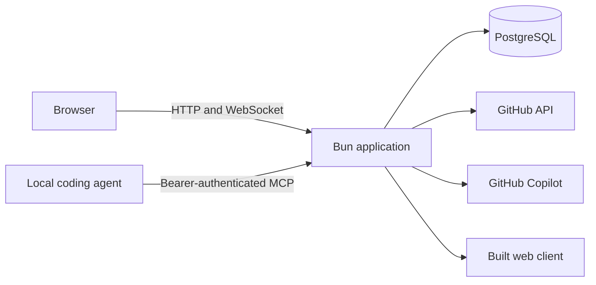
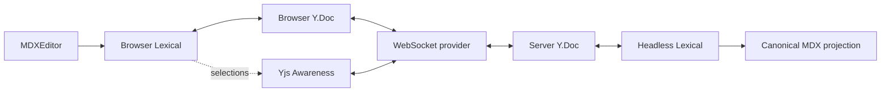
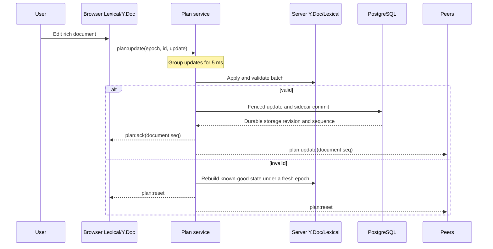

# Architecture

Chopin is one Bun application, one browser client, and one PostgreSQL database.
The application serves the built client, HTTP API, Streamable HTTP MCP endpoint,
and WebSocket from the same origin. GitHub supplies identity and repository
authorization; GitHub Copilot supplies the hosted Planner runtime.

This document describes the system boundaries and collaborative document model.
See [Repository channels](channels.md) for channel creation and access,
[Authentication](authentication.md) for identity, [Storage](storage.md) for the
durable model, and [Self-hosting](self-hosting.md) for deployment.

## Vocabulary

- A **channel** is the durable collaborative workspace associated with one
  GitHub repository.
- The **plan** is the channel's canonical restricted-MDX document and its rich
  collaborative representation.
- A **document** is the public MCP projection of a channel, including its plan,
  brief, repository provenance, and revision where applicable.
- A **room** is the server's live in-memory representation of an open channel.
- The **Planner** is Chopin's hosted Copilot-backed planning agent.
- A **coding agent** is an external MCP client that creates or implements a
  document from its own local workspace.

## System context

The browser uses a process-local GitHub App user session. Browser HTTP routes
and the WebSocket intersect that identity's repository role with repositories
selected in a GitHub App installation. The external MCP endpoint instead checks
its caller-supplied GitHub bearer token directly. Both paths apply the instance
admission policy.

The application holds an exclusive database-wide writer lease. It refuses to
start beside another active Chopin process and stops if it can no longer renew
the lease. This is a single-writer design, not an application cluster.

## Workspace packages

| Area                | Responsibility                                                                       | Internal dependencies                         |
| ------------------- | ------------------------------------------------------------------------------------ | --------------------------------------------- |
| `packages/dialect`  | Restricted MDX dialect, parsing, serialization, and Lexical schema                   | none                                          |
| `packages/protocol` | WebSocket types and shared addressing helper                                         | none                                          |
| `packages/question` | Questionnaire definitions, shared drafts, and answer derivation                      | `protocol`                                    |
| `packages/viewport` | Browser viewport geometry and subscriptions                                          | none                                          |
| `packages/editor`   | Collaborative editor, cursors, decisions, comments, and widgets                      | `dialect`, `question`, `protocol`, `viewport` |
| `apps/server`       | Authentication, channels, rooms, storage, Planner, MCP, and implementation lifecycle | `dialect`, `question`, `protocol`             |
| `apps/web`          | Repository picker, channel navigation, conversation, and workspace shell             | `dialect`, `editor`, `protocol`, `viewport`   |

Runtime workspace packages do not depend on either application. The E2E suite
and skill contract tests deliberately import server internals as test harnesses;
they are not runtime dependency boundaries.

## Trust boundaries

### Plan content

The MDX dialect is an allowlist. Imports, exports, expressions, raw HTML, and
unknown JSX are rejected. Plan content is parsed and rendered; it is never
evaluated. Every accepted document state must serialize through the registered
dialect and pass server-side validation.

### Browser and WebSocket

A browser request needs a valid process-local session, current instance
admission, a matching GitHub App installation, and the required repository role.
Open sockets periodically recheck those conditions. Pull access is read-only;
push or administration access permits mutation.

### Local MCP

`/mcp` authenticates a GitHub bearer supplied by the coding agent. It applies
instance admission and checks that token's current repository role without
requiring the GitHub App for Chopin installation. Pull access permits reads;
push or administration access permits document creation and implementation
lifecycle mutations.

### Hosted Planner

The first eligible editor to invoke the Planner becomes the channel owner for
the lifetime of that process session. Permission callbacks recheck admission,
session identity, credential revision, ownership generation, repository role,
and App installation before execution. The Planner has bounded, repository-fixed
read tools and no ambient checkout, shell, or host filesystem.

## State ownership

### Durable PostgreSQL state

- user identity records and token-free process-session registry rows;
- channel metadata and repository identity;
- complete Yjs checkpoints and the accepted update journal after each
  checkpoint;
- canonical MDX and a versioned sidecar containing questions, shared drafts,
  comments, decisions, transcript, relationships, creation metadata,
  implementation graphs, active execution, and run history;
- reserved Planner summary and transcript cursor fields, plus the ownership
  reference and generation; and
- migrations and the database writer lease.

### Process-local state

- browser cookie verifiers and GitHub access and refresh tokens;
- open rooms, pending update batches, and persistence coordinators;
- disposable Copilot SDK sessions and copied credentials; and
- repository and admission caches.

Startup deliberately clears every process-session registry row and Planner
owner reference. Transcripts, plan state, reserved context fields, and
implementation runs remain. The current runtime does not generate a durable
summary or advance its transcript cursor.

### Ephemeral state

Yjs Awareness carries browser cursors and selections. It is relayed but never
stored. The live Planner cursor also uses presence state. Planner change marks
are broadcast decoration: a browser retains at most 50 unseen marks until they
enter the viewport, the editor is cleared, or the epoch changes. The server does
not persist or replay them after a reconnect.

## Counters and identities

Several independent counters prevent different classes of stale write. They are
not interchangeable:

| Value                      | Scope and purpose                                                                                                                                             |
| -------------------------- | ------------------------------------------------------------------------------------------------------------------------------------------------------------- |
| Yjs epoch                  | Identifies one collaborative history. Rebuild or replacement creates a new epoch so clients discard incompatible updates.                                     |
| Document sequence          | Advances for accepted document updates and server-authored document mutations. It is the `seq` used by plan update and acknowledgement messages.              |
| Plan revision              | Optimistic-concurrency token for canonical plan reads and Planner block operations. One accepted document batch or server-authored plan mutation advances it. |
| Storage channel revision   | Advances for every durable channel commit, including sidecar-only transcript, graph, draft, or relationship changes. It fences adapter writes.                |
| Storage sequence           | Orders committed updates and events. Sidecar-only commits can create gaps in the Yjs update journal because they still consume a sequence.                    |
| Graph version and revision | Identify one implementation graph generation and the edits within its current draft. A claim also binds the exact plan revision.                              |

Channel IDs, update IDs, operation IDs, component IDs, and lifecycle idempotency
keys solve separate identity problems. See [Repository channels](channels.md) for
channel ID construction and [Experimental implementation lifecycle](implementation-lifecycle.md)
for graph counters.

## Collaborative document

Chopin represents one plan in three forms: Lexical for rich editing, Yjs for
live collaboration, and canonical MDX for a readable durable projection. These
are not competing sources of truth. While a room is open, the server's Yjs
document and its headless Lexical mirror are authoritative.

The browser mounts MDXEditor and binds its Lexical editor to a browser Y.Doc
with `@lexical/yjs`. The server owns the authoritative Y.Doc for each open room.
A headless Lexical editor bound to it lets the server interpret CRDT updates,
validate the resulting tree, and project canonical MDX without trusting a
connected browser to serialize the plan.

The room also holds counters, question and comment records, transcript, Planner
context, implementation state, pending client batches, and its persistence
coordinator.

## Human edit flow

1. A browser edit updates Lexical and `@lexical/yjs` produces a Yjs update.
2. The provider retains that update until acknowledgement and replays it after a
   reconnect when necessary.
3. The server groups client updates for 5 ms and applies the batch to its Y.Doc.
4. The headless mirror catches up and projects canonical MDX.
5. The merged update and current sidecar commit under the writer fence.
6. Only after that commit does the server acknowledge the sender and relay the
   accepted state.
7. The accepted state becomes the latest known-good rebuild point and schedules
   a complete checkpoint.

Yjs cannot roll back a transaction. If a batch leaves the document invalid, the
room rebuilds its last known-good state under a fresh epoch and every client
reopens. Awareness uses a separate ephemeral path.

## Planner edit flow

The Planner reads canonical MDX, a plan revision, and an outline of addressable
top-level blocks. `edit_plan` accepts structural block operations against that
revision rather than a text patch.

1. Operations stage against parsed MDAST without touching the live room.
2. New fragments are parsed, restricted components are refused, and missing
   component IDs are minted by the server.
3. The assembled document is serialized, parsed again, dialect-validated, and
   checked through a Lexical import/export round trip.
4. Existing MDAST objects identify untouched or moved blocks. Their live Lexical
   nodes are reused; genuinely new blocks receive new nodes.
5. Lexical produces a Yjs delta. The server finalizes records, reviews
   relationships, and attributes accepted-comment results.
6. The delta and sidecar commit before broadcast.
7. The server derives added, moved, and removed marks and places the Planner
   cursor at the end of the final changed block.

The update is broadcast before its change description, so clients possess every
node a mark names before trying to draw it. Explicit operations also preserve
unaffected selections, cursors, undo history, and provenance that a structural
diff could only guess.

## Conversation addressing

The web composer uses the shared `addressed()` helper to translate an `@ai`
mention into `Chat.Send.to = "planner"`; other messages use `to = "room"`. The
wire destination is authoritative on the server. A custom write-authorized
client can therefore address the Planner explicitly without including the
mention in its text. `instruction()` removes a mention before model input.

Channel messages remain durable transcript entries. A bounded recent window
enters the next Planner turn, and a separately bounded transcript bootstrap is
used when a disposable Copilot session is recreated. The full transcript is not
sent to every turn.

## Decisions and anchors

Question answers and accepted comment threads belong to durable records outside
the document. Their `<Questionnaire>` and `<Decision>` nodes are readable MDX
projections. Domain operations and Planner block tools update or protect the
record and projection together. Browser Yjs validation currently checks the
dialect but does not independently compare those projections with their records,
so a custom client can create an inconsistent projection without changing the
authoritative decision record.

A relationship points from one of those records to top-level plan blocks. Each
anchor combines a Yjs relative position with a digest of the canonical block.
The position survives surrounding edits; the digest can recover one unique
match after a move or epoch change. Ambiguous or missing matches are orphaned
rather than guessed.

The browser sends block indices, a bounded quote locator, a selection length,
and an offset hint. The server resolves that locator against canonical MDX and
mints Yjs relative positions for the durable passage. Those positions let the
range move with normal edits; the quote is a fallback when they no longer
resolve, and two equally plausible matches recover neither. The server does not
yet enforce every browser-side size and ordering bound on a custom wire request.

## Persistence and recovery

Accepted document updates and normal domain mutations commit before
acknowledgement or broadcast.
Checkpointing later folds the update journal into a complete Yjs state and
deletes journal entries through the checkpoint sequence. Recovery uses a
repeatable-read snapshot, validates that checkpoint bytes project to the stored
MDX, replays ordered updates, restores sidecar state, and preserves the epoch.

Checkpointing prunes only the Yjs update journal. Operation idempotency and event
tables have separate retention behavior. See [Storage](storage.md) for the table
model and adapter contract.

## Implementation graphs

The hosted Planner can draft a versioned task graph against one plan revision in
any channel. The supported MCP read-before-claim flow exposes graphs only when
the document has MCP creation metadata. An approved graph can then be claimed
for one logical run, after which task, pull-request, blocker, and verification
transitions are persisted before publication. An active run locks plan changes
that would invalidate the graph.

The backend lifecycle is implemented, but there is currently no production UI
or route for a person to approve the draft. See
[Experimental implementation lifecycle](implementation-lifecycle.md).

## Known implementation gaps

The prototype still has several places where implementation falls short of the
intended boundaries above:

- `anchor_plan` does not await a question-placement document mutation before its
  separate sidecar persistence and anchor broadcast, leaving an ordering race.
- Idle-room eviction removes the registry entry before its asynchronous final
  close and checkpoint completes, so a replacement room can briefly overlap.
- Browser CRDT updates do not cross-check record-owned decision projections, and
  custom comment locators do not receive all browser-side bounds on the server.
- Implementation run authorization is repository-based rather than bound to the
  original claimant; any admitted repository writer with the run ID can report
  its lifecycle.
- `start_implementation` does not independently require MCP creation metadata,
  even though `read_implementation` does. A caller that somehow knows the exact
  graph counters can bypass the supported provenance-gated read path.

Treat these as implementation work, not guarantees to build new behavior upon.

## Main implementation points

- Browser collaboration: `packages/editor/src/collaboration.tsx` and
  `packages/editor/src/provider.ts`
- Protocol declarations: `packages/protocol/*.d.ts`
- Server document: `apps/server/src/plan/room.ts`
- Plan service and persistence coordinator: `apps/server/src/plan/service.ts`
- Planner tools and block operations: `apps/server/src/agent/tools.ts` and
  `apps/server/src/plan/edit.ts`
- Channel routes and IDs: `apps/server/src/channels/`
- Storage contract: `apps/server/src/storage/port.ts`
- PostgreSQL adapter and migrations: `apps/server/src/storage/postgres/`
- Implementation graphs and lifecycle: `apps/server/src/tasks/`
