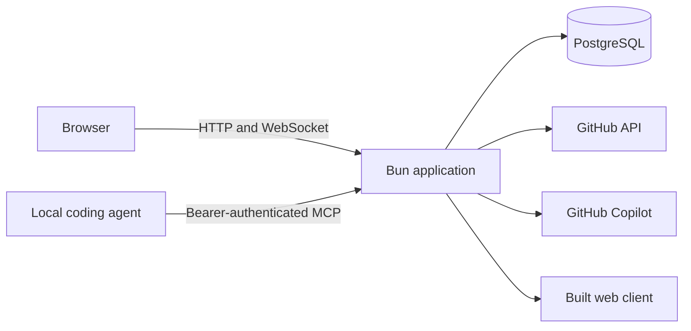
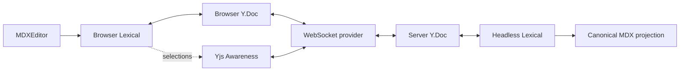
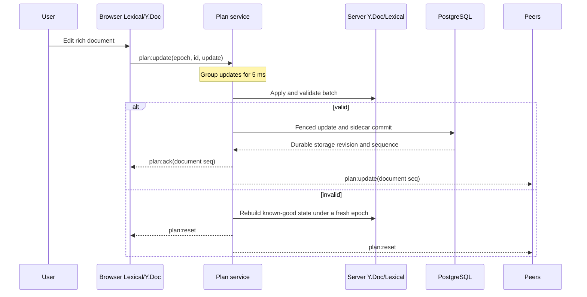

# Architecture

Chopin is one Bun application, one browser client, and one PostgreSQL database.
The application serves the built client, HTTP API, Streamable HTTP MCP endpoint,
and WebSocket from the same origin. GitHub supplies identity and repository
authorization; GitHub Copilot supplies the hosted document agent runtime,
currently named Planner.

This document describes the system boundaries and collaborative document model.
See [Repository channels](channels.md) for channel creation and access,
[Authentication](authentication.md) for identity, [Storage](storage.md) for the
durable model, [Background jobs](background-jobs.md) for isolated durable work,
and [Self-hosting](self-hosting.md) for deployment.

## Vocabulary

- A **document** is the collaboratively authored, repository-connected artifact
  represented as restricted MDX, Lexical, and Yjs.
- A **channel** is the durable collaboration container for one document, its
  conversation, decisions, repository identity, and sidecar state.
- An **MCP document** is the public API projection of a channel and document,
  including its ID, title, source, revision, optional generated description, and
  optional creation brief.
- A **plan** is a document being used for planning. It is not the product noun
  for every document.
- A **room** is the server's live in-memory representation of an open channel.
- A **research request** is durable work attached to one parent document. While
  pending, it is represented by an inline card rather than a channel, document,
  conversation, decision set, navigation row, or browser route.
- A **child document** is an ordinary channel attached to one top-level parent
  for navigation and context. It owns its document, Conversation, and Decisions.
  The V1 product surface offers neither child research nor grandchildren. The UI
  blocks starting research from a child; the API may accept the request, but
  publication validation rejects linking a grandchild.
- The **Planner** is the current name of Chopin's hosted Copilot-backed document
  agent.
- A **coding agent** is an external MCP client that creates or implements a
  document from its own local workspace.

The current UI, protocol, and server grew from a planning workflow and retain
literal names such as **Plan**, `plan:*`, `read_plan`, and `planRevision`. This
documentation uses **document** for the product artifact and **plan** only for a
planning-specific workflow or one of those implementation names.

The hosted agent's product role is document co-authoring, while its current
prompt remains optimized for planning.

## System context

The browser uses a process-local GitHub App user session. Browser HTTP routes
and the WebSocket intersect that identity's repository role with repositories
selected in a GitHub App installation. The external MCP endpoint instead checks
its caller-supplied GitHub bearer token directly. Both paths apply the instance
admission policy.

The application holds an exclusive database-wide writer lease. It refuses to
start beside another active Chopin process and stops if it can no longer renew
the lease. This is a single-writer design, not an application cluster.

## Workspace packages

| Area                | Responsibility                                                                             | Internal dependencies                         |
| ------------------- | ------------------------------------------------------------------------------------------ | --------------------------------------------- |
| `packages/dialect`  | Restricted MDX dialect, parsing, serialization, and Lexical schema                         | none                                          |
| `packages/protocol` | WebSocket types and shared addressing helper                                               | none                                          |
| `packages/question` | Questionnaire definitions, shared drafts, and answer derivation                            | `protocol`                                    |
| `packages/viewport` | Browser viewport geometry and subscriptions                                                | none                                          |
| `packages/editor`   | Collaborative editor, cursors, decisions, comments, and widgets                            | `dialect`, `question`, `protocol`, `viewport` |
| `apps/server`       | Authentication, channels, rooms, storage, Planner, jobs, MCP, and implementation lifecycle | `dialect`, `question`, `protocol`             |
| `apps/web`          | Repository picker, channel navigation, conversation, and workspace shell                   | `dialect`, `editor`, `protocol`, `viewport`   |

Runtime workspace packages do not depend on either application. The E2E suite
and skill contract tests deliberately import server internals as test harnesses;
they are not runtime dependency boundaries.

## Trust boundaries

### Document content

The MDX dialect is an allowlist. Imports, exports, expressions, raw HTML, and
unknown JSX are rejected. Document content is parsed and rendered; it is never
evaluated. Every accepted document state must serialize through the registered
dialect and pass server-side validation.

### Browser and WebSocket

A browser request needs a valid process-local session, current instance
admission, a matching GitHub App installation, and the required repository role.
Open sockets periodically recheck those conditions. Pull access is read-only;
push or administration access permits mutation.

### Local MCP

`/mcp` authenticates a GitHub bearer supplied by the coding agent. It applies
instance admission and checks that token's current repository role without
requiring the GitHub App for Chopin installation. Pull access permits reads;
push or administration access permits document creation and implementation
lifecycle mutations.

### Hosted agent

The first eligible editor to invoke the Planner or start a model-backed research
request becomes that channel's Planner owner for the lifetime of the process
session.
Permission callbacks recheck admission, session identity, credential revision,
ownership generation, repository role, and App installation before execution.
The Planner has bounded, repository-fixed read tools and no ambient checkout,
shell, or host filesystem. Model-backed `active-planner` workers use the same
owner credential but fresh isolated sessions; see
[Background jobs](background-jobs.md).

## State ownership

### Durable PostgreSQL state

- user identity records and token-free process-session registry rows;
- channel metadata and repository identity, including an optional generated
  description with source and job provenance;
- complete Yjs checkpoints and the accepted update journal after each
  checkpoint;
- background-job requests, normalized inputs, lifecycle and progress state, and
  immutable completed artifacts;
- parent-scoped research request staging records, their internal initial turns,
  links to immutable background-job artifacts, and an optional published child
  channel link;
- canonical MDX and a versioned sidecar containing questions, shared drafts,
  comments, decisions, transcript, relationships, creation metadata,
  implementation graphs, active execution, and run history;
- reserved Planner summary and transcript cursor fields, plus the ownership
  reference and generation; and
- migrations and the database writer lease.

### Process-local state

- browser cookie verifiers and GitHub access and refresh tokens;
- open rooms, pending update batches, and persistence coordinators;
- disposable Copilot SDK sessions and copied credentials; and
- repository and admission caches.

Startup deliberately clears every process-session registry row and Planner
owner reference. Transcripts, document state, reserved context fields, generated
descriptions, and implementation runs remain. The current runtime does not
generate the reserved Planner transcript summary or advance its transcript
cursor; `document-summary@1` artifacts and their catalogue projection are a
separate feature.

### Ephemeral state

Yjs Awareness carries browser cursors and selections. It is relayed but never
stored. The live Planner cursor also uses presence state. Planner change marks
are broadcast decoration: a browser retains at most 50 unseen marks until they
enter the viewport, the editor is cleared, or the epoch changes. The server does
not persist or replay them after a reconnect.

## Browser content swaps

The host that owns a changing surface also owns its motion contract and keyed
retention. The shared `ContentSwapLayer` owns presence timing: it makes an
inactive layer `inert` and `aria-hidden` immediately, then hides it and notifies
the host after its visual exit. Pointer input follows the host's transition
contract; keyboard input and reduced-motion preferences settle the transition
immediately.

The editor's questionnaire host renders the current question and retains at most
one outgoing question until that layer closes. Document navigation similarly
keeps the active route, at most one outgoing route, and an optional pending
route. A pending document load stays mounted but hidden and inert until it is
ready, so the existing document remains interactive. Navigation publishes only
the active ready channel; readiness reported later by an outgoing route cannot
replace it.

## Counters and identities

Several independent counters prevent different classes of stale write. They are
not interchangeable:

| Value                      | Scope and purpose                                                                                                                                             |
| -------------------------- | ------------------------------------------------------------------------------------------------------------------------------------------------------------- |
| Yjs epoch                  | Identifies one collaborative history. Rebuild or replacement creates a new epoch so clients discard incompatible updates.                                     |
| Document sequence          | Advances for accepted document updates and server-authored document mutations. It is the `seq` used by `plan:update` and `plan:ack`.                          |
| Plan revision              | Plan-named optimistic-concurrency token for document reads and Planner block operations. One accepted document batch or server-authored mutation advances it. |
| Storage channel revision   | Advances for every durable channel commit, including sidecar-only transcript, graph, draft, or relationship changes. It fences adapter writes.                |
| Storage sequence           | Orders committed updates and events. Sidecar-only commits can create gaps in the Yjs update journal because they still consume a sequence.                    |
| Description revision       | Orders generated catalogue-description projections. It advances independently and does not change collaboration counters or channel activity time.            |
| Graph version and revision | Identify one implementation graph generation and the edits within its current draft. A claim also binds the exact plan revision.                              |
| Research revision          | Orders durable request, job-link, and internal staging changes independently from the parent document, background-job channel revision, and job revisions.    |

Channel IDs, update IDs, operation IDs, component IDs, and lifecycle idempotency
keys solve separate identity problems. See [Repository channels](channels.md) for
channel ID construction and [Experimental implementation lifecycle](implementation-lifecycle.md)
for graph counters.

A channel UUID is the stable internal document identity used by storage, UUID
API routes, WebSocket rooms, and MCP lifecycle mutations. A top-level browser
document uses `/documents/:owner/:repository/:slug`; a child uses
`/documents/:owner/:repository/:parentSlug/children/:childSlug`. Direct child
entry loads both channels and rejects a repository or recorded-parent mismatch.
Slugs retain Unicode letters, numbers, and marks, add numeric suffixes for
collisions, and keep every former canonical slug as an alias. Renaming changes
the canonical route without changing the UUID or plan revision.

Browser creation `Location` headers and MCP `create_document.url` expose the
readable route. MCP `read_document` and `read_implementation` bridge the two
identities by accepting either the canonical URL or UUID and returning the UUID;
lifecycle calls continue to use that returned UUID. Legacy repository and UUID
browser paths resolve through the existing internal routes before the browser
replaces them with the canonical readable location.

## Research requests and child publication

Typing `/research` inserts a local composer into the parent document. Submitting
it persists the exact brief and starts work immediately. The resulting
`<Research id="…" />` block is only a reference: authoritative request state,
job links, progress, sources, errors, and publication identity live in durable
parent-scoped records. The parent WebSocket announces `research:changed`; the
browser then refreshes that request over HTTP.

The public worker receives only the submitted brief, with no private document
context. It may derive or refine the queries it sends to web search. After its
evidence artifact validates, one isolated private worker analyses the parent
document from the brief and document snapshot. A second isolated private worker
receives the brief, normalized public evidence, and private findings, then
synthesizes the complete report. Neither private worker has web access. No
partial report prose is published. Failure and cancellation create no child; an
explicit retry keeps the request identity and immutable brief while replacing
only its terminal job links.

Successful reconciliation validates and converts the report to canonical MDX.
One fenced storage transaction then creates a revision-zero child channel with
complete Yjs and sidecar state and links that channel to the request. Until both
writes commit, the card has no child URL and repository navigation has no child
row. Reconciliation and publication are idempotent, so a restart or repeated
read cannot publish a duplicate.

The browser nests published children beneath their parent. Opening a ready card
or nested row keeps the parent mounted but inert behind an anchored child
surface. The child opens through its ordinary channel stack with its own
Conversation and Decisions; closing, Escape, and browser Back restore the
parent's history, scroll, selection, and opener focus. Compact layouts occupy
the viewport, and reduced motion uses a crossfade.

## Collaborative document

Chopin represents one document in three forms: Lexical for rich editing, Yjs for
live collaboration, and canonical MDX for a readable durable projection. These
are not competing sources of truth. While a room is open, the server's Yjs
document and its headless Lexical mirror are authoritative.

The browser mounts MDXEditor and binds its Lexical editor to a browser Y.Doc
with `@lexical/yjs`. The server owns the authoritative Y.Doc for each open room.
A headless Lexical editor bound to it lets the server interpret CRDT updates,
validate the resulting tree, and project canonical MDX without trusting a
connected browser to serialize the document.

The room also holds counters, question and comment records, transcript, Planner
context, implementation state, pending client batches, and its persistence
coordinator.

## Human edit flow

1. A browser edit updates Lexical and `@lexical/yjs` produces a Yjs update.
2. The provider retains that update until acknowledgement and replays it after a
   reconnect when necessary.
3. The server groups client updates for 5 ms and applies the batch to its Y.Doc.
4. The headless mirror catches up and projects canonical MDX.
5. The merged update and current sidecar commit under the writer fence.
6. Only after that commit does the server acknowledge the sender and relay the
   accepted state.
7. The accepted state becomes the latest known-good rebuild point and schedules
   a complete checkpoint.

Yjs cannot roll back a transaction. If a batch leaves the document invalid, the
room rebuilds its last known-good state under a fresh epoch and every client
reopens. Awareness uses a separate ephemeral path.

## Hosted agent edit flow

The hosted agent, currently named Planner, reads canonical MDX, a plan revision,
and an outline of addressable top-level document blocks. `edit_plan` accepts
structural block operations against that revision rather than a text patch.

1. Operations stage against parsed MDAST without touching the live room.
2. New fragments are parsed, restricted components are refused, and missing
   component IDs are minted by the server.
3. The assembled document is serialized, parsed again, dialect-validated, and
   checked through a Lexical import/export round trip.
4. Existing MDAST objects identify untouched or moved blocks. Their live Lexical
   nodes are reused; genuinely new blocks receive new nodes.
5. Lexical produces a Yjs delta. The server finalizes records, reviews
   relationships, and attributes accepted-comment results.
6. The delta and sidecar commit before broadcast.
7. The server derives added, moved, and removed marks and places the Planner
   cursor at the end of the final changed block.

The update is broadcast before its change description, so clients possess every
node a mark names before trying to draw it. Explicit operations also preserve
unaffected selections, cursors, undo history, and provenance that a structural
diff could only guess.

## Conversation addressing

The web composer uses the shared `addressed()` helper to translate an `@chopin`
mention into `Chat.Send.to = "planner"`; other messages use `to = "room"`. The
wire destination is authoritative on the server. A custom write-authorized
client can therefore address the Planner explicitly without including the
mention in its text. `instruction()` removes a mention before model input.

Channel messages remain durable transcript entries. A bounded recent window
enters the next Planner turn, and a separately bounded transcript bootstrap is
used when a disposable Copilot session is recreated. The full transcript is not
sent to every turn.

## Decisions and anchors

Question answers and accepted comment threads belong to durable records outside
the document. Their `<Questionnaire>` and `<Decision>` nodes are readable MDX
projections. Domain operations and Planner block tools update or protect the
record and projection together. Browser Yjs validation currently checks the
dialect but does not independently compare those projections with their records,
so a custom client can create an inconsistent projection without changing the
authoritative decision record.

A relationship points from one of those records to top-level document blocks.
Each anchor combines a Yjs relative position with a digest of the canonical block.
The position survives surrounding edits; the digest can recover one unique
match after a move or epoch change. Ambiguous or missing matches are orphaned
rather than guessed.

The browser sends block indices, a bounded quote locator, a selection length,
and an offset hint. The server resolves that locator against canonical MDX and
mints Yjs relative positions for the durable passage. Those positions let the
range move with normal edits; the quote is a fallback when they no longer
resolve, and two equally plausible matches recover neither. The server does not
yet enforce every browser-side size and ordering bound on a custom wire request.

## Persistence and recovery

Accepted document updates and normal domain mutations commit before
acknowledgement or broadcast.
Checkpointing later folds the update journal into a complete Yjs state and
deletes journal entries through the checkpoint sequence. Recovery uses a
repeatable-read snapshot, validates that checkpoint bytes project to the stored
MDX, replays ordered updates, restores sidecar state, and preserves the epoch.

Checkpointing prunes only the Yjs update journal. Operation idempotency and event
tables have separate retention behavior. See [Storage](storage.md) for the table
model and adapter contract.

## Generated document descriptions

Chopin can derive optional catalogue metadata from canonical document source.
The durable job remains `document-summary@1`; `document-summary@2` does not
exist. New V1 requests carry `output:"description"` and use
`description-v1:<plan revision>:<source hash>` as their idempotency key. This
lets an unchanged document with only a legacy markerless summary regenerate
lazily when it next follows an open, edit, restore, or MCP creation/replay
scheduling path and an active Planner owner is available. There is no unattended
all-document backfill.

The private worker returns one physical line identifying document type, purpose,
and subject, such as a PRD, RFC, or Plan. Blank source yields `Empty document`.
Markerless V1 summary artifacts remain readable background results but are not
projected. Marked completions are idempotently stored in channel metadata with
source plan revision and hash, generator version, job ID, projection time, and
an independent description revision. Existing metadata remains in place while
newer work is pending or failed, and projection changes neither collaboration
revision nor channel `updatedAt`.

Browser lists, document and reference pickers, and title-or-description search
show the optional value. MCP document reads, lists, and common document summaries
also expose it. A description is untrusted model output, not authoritative
document content. The structured MCP creation `brief` and reserved Planner
transcript `summary` remain separate fields with separate purposes.

## Implementation graphs

The hosted Planner's graph tools can technically draft a versioned task graph
against one plan revision in any channel. The child browser surface does not
expose implementation or tasks, so child implementation is not a supported
product workflow. The supported MCP read-before-claim flow exposes graphs only
when the document has MCP creation metadata. An approved graph can then be
claimed for one logical run, after which task, pull-request, blocker, and
verification transitions are persisted before publication. An active run locks
plan changes that would invalidate the graph.

The backend lifecycle is implemented, but there is currently no production UI
or route for a person to approve the draft. See
[Experimental implementation lifecycle](implementation-lifecycle.md).

## Known implementation gaps

The prototype still has several places where implementation falls short of the
intended boundaries above:

- `anchor_plan` does not await a question-placement document mutation before its
  separate sidecar persistence and anchor broadcast, leaving an ordering race.
- Idle-room eviction removes the registry entry before its asynchronous final
  close and checkpoint completes, so a replacement room can briefly overlap.
- Browser CRDT updates do not cross-check record-owned decision projections, and
  custom comment locators do not receive all browser-side bounds on the server.
- Implementation run authorization is repository-based rather than bound to the
  original claimant; any admitted repository writer with the run ID can report
  its lifecycle.
- `start_implementation` does not independently require MCP creation metadata,
  even though `read_implementation` does. A caller that somehow knows the exact
  graph counters can bypass the supported provenance-gated read path.

Treat these as implementation work, not guarantees to build new behavior upon.

## Main implementation points

- Browser collaboration: `packages/editor/src/collaboration.tsx` and
  `packages/editor/src/provider.ts`
- Protocol declarations: `packages/protocol/*.d.ts`
- Server document: `apps/server/src/plan/room.ts`
- Plan service and persistence coordinator: `apps/server/src/plan/service.ts`
- Planner tools and block operations: `apps/server/src/agent/tools.ts` and
  `apps/server/src/plan/edit.ts`
- Channel routes and IDs: `apps/server/src/channels/`
- Research requests and child publication: `apps/server/src/research/service.ts`
- Inline request state and anchored children: `apps/web/src/research-requests.ts`
  and `apps/web/src/anchored-child-surface.tsx`
- Storage contract: `apps/server/src/storage/port.ts`
- PostgreSQL adapter and migrations: `apps/server/src/storage/postgres/`
- Implementation graphs and lifecycle: `apps/server/src/tasks/`
