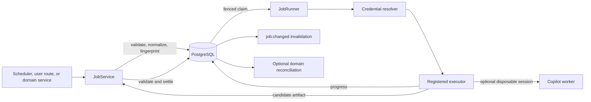

# Background jobs and workers

Chopin's background system runs durable, versioned work outside the shared
Planner conversation. A job may execute ordinary code or open one or more
isolated Copilot worker sessions. The code calls the durable unit a **background
job**; this document uses **worker** for the disposable execution session. A
worker is not a child Planner turn, coding agent, or runtime plugin.

> [!IMPORTANT]
> The registry is a closed, code-owned allowlist. Persisted rows name a
> registered job type and version; they never contain executable code. Adding a
> job requires a source change and deployment.

This guide covers the generic job framework, how to register a new definition,
and the worker boundaries used by document summaries and Research Workspaces.
See [Hosted agent](hosted-agent.md) for the Planner conversation and
[Storage](storage.md) for the broader durable model.

## Vocabulary

| Term                            | Meaning                                                                                            |
| ------------------------------- | -------------------------------------------------------------------------------------------------- |
| Definition                      | The code-owned `JobDefinition` for one `type@version`.                                             |
| Job                             | One durable request, including normalized input and lifecycle state.                               |
| Target                          | The semantic resource a job updates, such as one document or Research Workspace turn.              |
| Target generation               | The newest request for a target. A newer generation supersedes older active work.                  |
| Attempt                         | One job claim. Credential or capacity failure may prevent its executor from starting.              |
| Failure                         | An attempt that consumes retry budget. `failures`, not `attempts`, is compared with `maxAttempts`. |
| Claim generation                | A fencing counter that prevents an expired or cancelled worker from publishing late output.        |
| Artifact                        | The immutable, validated JSON result written only when a job completes.                            |
| Worker                          | A disposable execution context, optionally backed by an isolated Copilot SDK session.              |
| Background Work                 | The generic browser view of current jobs, progress, and supported result previews.                 |
| Background-job channel revision | The invalidation counter for job mutations in one channel, separate from each job's revision.      |

Keep these counters separate from the Yjs epoch, document sequence, plan
revision, storage revision, Research Workspace revision, and implementation
graph counters.

## Architecture



The main boundaries are:

- `JobRegistry` stores every supported definition version and selects the
  highest version for new work.
- `JobService` owns origin checks, canonical JSON, byte limits, fingerprints,
  enqueueing, control mutations, artifact validation, and publication hooks.
- `BackgroundJobStore` owns durable state transitions, target generations,
  claims, progress, and artifacts.
- `JobRunner` polls and wakes for work, resolves credentials, enforces
  concurrency, heartbeats claims, executes definitions, and handles retries and
  shutdown.
- A definition's executor owns the actual work and any worker-specific
  capability boundary.

Product code should enqueue through `JobService`, not call
`storage.jobs.enqueue()` directly. The raw storage port enforces persistence
invariants but does not know registry versions, origins, codecs, or byte limits.

## Registration checklist

1. Choose a stable lowercase type and start at version 1.
2. Define strict, deterministic input and artifact codecs.
3. Select only the origins an actual caller needs; enforce authorization at the
   route, socket, scheduler, or tool boundary.
4. Select `active-planner` or `none` deliberately. For a user-triggered
   `active-planner` job, establish or validate ownership before enqueueing.
5. Set timeout, failure budget, aggregate AI-credit metadata, and byte limits.
6. Declare fixed progress stages without private or model-generated text.
7. Implement execution with cancellation, deadlines, and bounded cleanup.
8. For model work, use fresh audited workers and structured result tools.
9. Add a publication hook only when completion needs a freshness gate.
10. Register every supported version in `apps/server/src/main.ts`.
11. Add an explicit scheduler, route, domain service, or Planner tool that
    enqueues through the matching `JobService.enqueue*()` method.
12. Choose stable target and idempotency keys; do not pre-prefix the target.
13. Add idempotent domain reconciliation if completion creates related state.
14. Add explicit browser or Planner projection only when required.
15. For new domain persistence, add and register a migration, update both
    adapters, and extend the shared storage contract.
16. Test codecs, origins, authorization, retries, cancellation, credentials,
    publication, storage contracts, and every exposed UI path.

## Definition contract

A registered definition has this shape:

```ts
type JobDefinition<Input extends JsonValue, Artifact extends JsonValue> = {
	type: string;
	version: number;
	label: string;
	description: string;
	origins: readonly ("scheduler" | "planner" | "user")[];
	credential: "active-planner" | "none";
	limits: {
		timeoutMs: number;
		maxAttempts: number;
		maxAiCredits: number;
		maxInputBytes: number;
		maxArtifactBytes: number;
	};
	progress?: Readonly<Record<string, string>>;
	input: { parse(value: JsonValue): Input };
	artifact: { parse(value: JsonValue): Artifact };
	execute(execution: JobExecution<Input>): Promise<Artifact>;
	publish?(publication: JobPublication): Promise<void>;
};
```

`JobRegistry` validates definitions when the process starts:

- types and progress stages use lowercase hyphenated identifiers;
- versions and limits are positive safe integers;
- labels and descriptions are nonblank;
- at least one origin is declared, with distinct members of `scheduler`,
  `planner`, and `user`;
- credential mode is `active-planner` or `none`;
- progress, when present, has 1 through 32 code-owned labels, each at most 160
  characters;
- only one definition may claim a particular `type@version`.

`label` and `description` are catalog metadata. The current generic browser UI
does not render them automatically.

### Strict codecs

Input and artifact codecs are security and compatibility boundaries. They
should:

- accept exact fields and reject unknown ones;
- normalize deterministically;
- enforce semantic, collection, and string bounds;
- return plain JSON only;
- reject `undefined`, dates, class instances, accessors, sparse arrays,
  non-finite numbers, and cyclic values;
- validate provenance and relationships rather than trusting model output.

`JobService` canonicalizes JSON before and after the input codec. Object keys are
sorted, nesting is bounded, UTF-8 bytes are measured, and the normalized form is
used in the idempotency fingerprint. Settlement applies the same process to the
artifact codec.

Changing a persisted contract normally requires a new definition version. Keep
old versions registered while durable pending, paused, or running rows can still
reference them. New enqueue requests use the highest registered version; the
runner and settlement always resolve the exact persisted version.

## Minimal definition

The following skeleton shows a non-model job. Real codecs should usually be more
specific than these examples.

```ts
import { JobExecutionError } from "./registry";

import type { JsonValue } from "../storage/model";
import type { JobDefinition } from "./registry";

type ExampleInput = {
	resourceId: string;
};

type ExampleArtifact = {
	resourceId: string;
	result: string;
};

async function analyze(
	resourceId: string,
	signal: AbortSignal,
	deadline: Date,
): Promise<string> {
	if (signal.aborted || Date.now() >= deadline.getTime()) {
		throw new Error("analysis stopped");
	}
	return `Analyzed ${resourceId}`;
}

function record(value: JsonValue): Record<string, JsonValue> {
	if (!value || typeof value !== "object" || Array.isArray(value)) {
		throw new Error("expected object");
	}
	return value;
}

function input(value: JsonValue): ExampleInput {
	let item = record(value);
	let resourceId = typeof item.resourceId === "string" ? item.resourceId.trim() : "";
	if (Object.keys(item).length !== 1 || !resourceId || resourceId.length > 128) {
		throw new Error("invalid example input");
	}
	return { resourceId };
}

function artifact(value: JsonValue): ExampleArtifact {
	let item = record(value);
	if (
		Object.keys(item).length !== 2
		|| typeof item.resourceId !== "string"
		|| typeof item.result !== "string"
		|| item.result.length > 4_000
	) throw new Error("invalid example artifact");
	return { resourceId: item.resourceId, result: item.result };
}

export function exampleDefinition(): JobDefinition<ExampleInput, ExampleArtifact> {
	return {
		type: "example-analysis",
		version: 1,
		label: "Example analysis",
		description: "Analyzes one example resource.",
		origins: ["user"],
		credential: "none",
		progress: { analyze: "Analyzing resource" },
		limits: {
			timeoutMs: 60_000,
			maxAttempts: 2,
			maxAiCredits: 1,
			maxInputBytes: 8 * 1024,
			maxArtifactBytes: 16 * 1024,
		},
		input: { parse: input },
		artifact: { parse: artifact },
		async execute(execution) {
			await execution.progress("analyze", "started");
			if (execution.signal.aborted) {
				throw new JobExecutionError("analysis-cancelled");
			}
			let result = await analyze(
				execution.input.resourceId,
				execution.signal,
				execution.deadline,
			);
			await execution.progress("analyze", "completed");
			return artifact({ resourceId: execution.input.resourceId, result });
		},
	};
}
```

Even a credential-free definition currently needs positive `maxAiCredits`.
That field is catalog metadata, not proof that AI is used.

## Register a definition

Definitions are assembled explicitly in `apps/server/src/main.ts`:

```ts
let definitions: JobDefinition[] = [];
if (config.backgroundJobs) {
	definitions.push(exampleDefinition());
}
let jobRegistry = new JobRegistry(definitions);
```

There is no directory scan or plugin discovery. Register every version that may
still have durable work:

```ts
definitions.push(exampleDefinitionV1(), exampleDefinitionV2());
```

Registration alone does not schedule work or create an API. Add an explicit
enqueue path using the intended origin method:

```ts
let result = await jobs.enqueueUser({
	channelId,
	type: "example-analysis",
	targetKey: resourceId,
	idempotencyKey: `example-analysis:${requestId}`,
	input: { resourceId },
});
```

Choose the origin method deliberately:

| Method               | Intended caller                                 |
| -------------------- | ----------------------------------------------- |
| `enqueueScheduler()` | A code-owned scheduler or coordinator.          |
| `enqueuePlanner()`   | A Planner tool or Planner-origin domain action. |
| `enqueueUser()`      | An explicit authenticated user action.          |

Callers do not supply an origin field. The service stamps it and checks that the
definition permits it.

Origins record how work entered the system; they are not authentication or
authorization. A browser route must still authenticate the session, enforce
Origin, admission, repository node identity, and role. Planner tools and
schedulers must enforce their own trusted ingress before calling `JobService`.

The caller supplies the semantic target without the job type prefix.
`JobService` changes `resource-id` into
`example-analysis:resource-id`. Supplying an already-prefixed target would
produce `example-analysis:example-analysis:resource-id`.

### Idempotency and supersession

An idempotency key is unique within a channel. Reusing it with the same
fingerprint returns the original job with `repeated: true`; reusing it with
different normalized input, origin, target, version, or availability conflicts.

A new idempotency key for the same target increments the target generation and
supersedes older pending, paused, or running generations. Older terminal rows
remain durable, but consumers must reject artifacts whose target generation is
no longer current.

Use request identity for idempotency and resource identity for the target. Do
not generate both from the current time.

## Durable lifecycle

```text
pending -> running
pending/running -> paused
paused -> pending
running -> pending       retry or process recovery
running -> completed
running -> failed
pending/paused/running -> cancelled
pending/paused/running -> superseded
```

The lifecycle is:

1. `JobService` resolves the current definition, validates origin and input,
   computes the fingerprint, and enqueues under the writer fence.
2. Storage advances the target generation, supersedes older active work, and
   inserts a pending row before `job:changed` is published.
3. `JobRunner` polls globally and wakes immediately for local pending changes.
4. Storage claims current pending work with `FOR UPDATE ... SKIP LOCKED`, or
   reclaims an expired running claim.
5. The runner resolves the exact persisted definition version and parses the
   persisted input again.
6. The runner resolves any required credential, stores only token-free binding
   metadata, and applies global and per-owner concurrency.
7. The executor receives cloned input, credential, abort signal, deadline, and
   progress callback.
8. `JobService` validates the candidate artifact and runs any publication hook.
9. Fenced storage atomically marks the job completed and inserts its immutable
   artifact.
10. Generic and domain-specific invalidations happen only after persistence.

The default runner uses global concurrency 2, per-owner concurrency 1, a
30-second claim TTL, a 10-second heartbeat, one-second polling, exponential
retry up to five minutes, and a 10-second shutdown grace period.

### Claims and late output

Every claimed mutation must match the channel, job ID, process claim owner,
claim generation, unexpired claim, and current target generation. Cancellation,
supersession, owner revocation, timeout, or shutdown clears or invalidates that
claim. A worker may continue briefly if it ignores cancellation, but its late
progress and artifact cannot commit.

`claim_owner` identifies the runner process, not the Planner owner or an
authorization principal.

### Attempts and retries

`attempts` increments on every claim. `failures` increments only when a retry
consumes failure budget. Despite its name, `JobLimits.maxAttempts` is currently
compared with `failures`.

Credential rotation, owner capacity, shutdown, and similar recovery paths may
requeue without increasing `failures`. A `JobExecutionError` supplies a safe,
code-owned durable reason; an unclassified executor failure becomes
`attempt-error`.

Definitions must honor both `execution.signal` and `execution.deadline`, and
must clean up disposable resources in `finally`. Fencing protects persistence;
it does not stop leaked external work.

### Progress and diagnostics

Progress stages must be declared by the definition. The executor can append
`started` and `completed`. The runner makes a best-effort `interrupted` append
while it still owns the claim; cancellation, supersession, or claim loss may
leave no interruption entry. Storage retains at most 32 entries.

Stage IDs, labels, and reason codes are durable and browser-visible. Structured
diagnostics are bounded but log-only. Neither category may contain:

- prompts or model prose;
- query text or private document content;
- source URLs or provider payloads;
- credentials, paths, or raw errors.

Use `JobExecutionError` for a bounded durable machine reason and optional
operator diagnostic. It accepts at most 16 boolean, nonnegative integer, or
token-like string diagnostic fields. Unknown browser reasons are deliberately
rendered as a generic interruption.

## Publication hooks

A definition may delay completion with `publish()`:

```ts
async publish({ job, artifact, commit }) {
	if (!await stillCurrent(job, artifact)) {
		throw new Error("target changed before publication");
	}
	await commit();
}
```

The hook runs after artifact validation but before settlement. It must call and
normally await `commit()` exactly once while the hook is active. A hook that
does not commit leaves the attempt uncompleted; a late or second commit is
rejected. If the hook commits and then throws, the durable completion remains
authoritative and the service logs the hook error.

Use a publication hook only when completion needs an external freshness or
serialization guard. Document summaries use one to hold the document mutation
gate and recheck revision and source hash. Ordinary jobs settle directly.

The generic service publication callback sends only a background-job channel
revision invalidation. A separate domain service may observe a completed job and
persist its own projection. That reconciliation must be idempotent and
recoverable on a later read because observer delivery is not a durable queue.

## Credentials and ownership

`credential: "active-planner"` means the job uses the channel's existing
Planner owner and Copilot entitlement. The runner resolves ownership through
`ActiveOwnerBindings`; it never claims ownership itself. An explicit product
action may establish ownership before enqueueing. Without an available owner,
the job pauses as `owner-unavailable`.

Resolution and later revalidation check the process-local session, credential
revision, ownership generation, instance admission, repository node identity,
GitHub App installation, repository write role, and expiry. Definitions must
never copy the GitHub token into input, artifacts, progress, diagnostics, or
PostgreSQL. A durable claim binding contains only the owner session ID, owner
generation, credential revision, and repository ID.

`credential: "none"` skips owner resolution. The current server still disables
the entire runner when `AGENT=off`, so a credential-free definition does not run
under that flag without a deliberate change to the main runner gate.

## Model-backed workers

Do not reuse the Planner conversation session. Every worker stage opens a fresh,
disposable SDK session. Most stages submit one bounded structured result;
document summaries reuse one disposable session for multiple bounded chunk and
reduction turns.

### Private worker

Use `Agent.openWorker()` for private document or repository-derived material.
The effective capability set must contain only the definition's terminal result
tool. Private workers receive no MCP server, web search, URL fetch, repository
tool, shell, filesystem, host Git, skill, or plugin.

### Public research worker

Use `Agent.openPublicResearchWorker()` only for an explicitly disclosed public
query. Its fail-closed capability audit requires exactly:

```text
custom:submit_research_result
github-mcp-server/web_search
```

Never give one session both private context and public web capability. The
public evidence worker receives only the confirmed query; a later private
answer worker receives normalized evidence and private context.

Accepted public sources must be canonical public HTTPS URLs observed in
successful web-search citation or typed-resource metadata. Bare URLs in model
prose do not establish provenance. Chopin never follows, resolves, or fetches a
source URL, and generated reports may cite only URLs retained in normalized
evidence. This validates provenance, not factual accuracy or page safety.

### Executor-owned limits

`JobLimits.maxAiCredits` is not centrally enforced by `JobRunner`. It describes
the maximum aggregate credits for one job attempt. A model-backed executor must
set per-session limits whose possible total does not exceed it; for example, a
60-credit two-stage job can allocate 30 credits to each worker. The current
worker helper requires at least 30 credits per session. Keep definition metadata
and actual worker construction synchronized.

Always recheck `credential.authorize`, observe credential and job abort signals,
and discard the SDK session in `finally`.

## Current definitions

| Definition            | Production trigger                             | Persisted input                                                                  | Worker boundary                                                                           |
| --------------------- | ---------------------------------------------- | -------------------------------------------------------------------------------- | ----------------------------------------------------------------------------------------- |
| `document-summary@1`  | Scheduler after canonical document persistence | Revision, source hash, generator version; not the source                         | Private worker; source loaded at execution and publication rechecks current revision/hash |
| `research-evidence@1` | Human confirmation or explicit Search more     | Workspace, turn, exact public query                                              | Public worker with only result tool and audited `web_search`                              |
| `research-answer@1`   | Completed evidence or private follow-up        | Document source snapshot, evidence, bounded thread, and optional original report | One or two private workers with only result tools                                         |

Allowed origins are broader than current callers: summary permits scheduler and
planner; research definitions permit user and planner. Current production
enqueue paths use scheduler for summaries and user for research execution.

Document-summary artifacts are not the reserved Planner transcript summary.
They are not injected into a later Planner turn automatically. The Planner may
explicitly call `list_background_jobs` and `read_background_job`, and must treat
the returned artifact as untrusted evidence.

## Research Workspace orchestration

Research Workspaces illustrate a multi-job domain workflow:

1. Sidebar or Planner creates a private, durable draft. This starts no
   background research.
2. A writer reviews and confirms the exact public query. This or any later new
   model-backed turn may establish the channel's Planner owner when none exists.
3. A `research-evidence` job sends only that query to public web search.
4. Completed normalized evidence causes an idempotent `research-answer` enqueue.
5. The answer job captures current canonical document context and runs without
   web capability.
6. The immutable report remains in the answer artifact; a validated summary is
   projected into the append-only workspace thread.
7. Ordinary follow-ups create only private answer jobs. Search more creates a
   new public evidence job followed by a private answer job.

Workspace and job mutations are separate fenced commits. Stable targets and
idempotency keys let reconciliation find and link a job after interruption.
Completion observation also runs when a workspace is read, not only from the
process-local job callback.

Here, **private** means not disclosed to public web search. Drafts, confirmed
queries, messages, and selected domain projections and artifacts are readable by
authorized parent-channel readers. Normalized job input is persisted but omitted
from browser and Planner job projections. Private worker material is still sent
to the hosted Copilot inference service under the active owner's credential.

## Archive and deletion

Archiving a document suspends its summary coordinator, cancels any pending
summary debounce, and prevents new summary scheduling. It does not blanket-cancel
background jobs already admitted for that channel. New Research Workspace
drafts, confirmations, follow-ups, and searches are blocked while archived, but
already-started evidence and answer jobs may settle, and their idempotent
workspace reconciliation may still persist.

Permanent deletion has a stronger boundary. The runner first blocks new claims
for the channel while summary scheduling remains suspended, aborts its active
attempts, cancels every pending, paused, or running job, and waits a bounded
grace period. The server then closes the live plan before atomically deleting
the archived channel. Claim fencing rejects any late worker progress or
artifact, and the channel delete cascades job targets, jobs, artifacts, Research
Workspaces, turns, and messages.

## Storage and retention

The generic schema supports a new standalone job type without a migration:

- `background_job_channels` stores the independent background-job channel
  revision;
- `background_job_targets` stores current target generations;
- `background_jobs` stores requests, state, claims, normalized input, progress,
  and sanitized failure reason;
- `background_job_artifacts` stores one immutable completed result per job.

A migration is needed only when the job adds domain-specific durable records or
links, as Research Workspaces do. When changing `StorageAdapter`, update the
model, port, memory adapter, PostgreSQL adapter, migration, migration registry in
`apps/server/src/storage/postgres/migrations.ts`, migration tests, and shared
contract suite together. Never edit an applied migration; checksums make that a
startup error. See [Storage](storage.md#postgresql-schema) for the table map.

Job summaries omit input, fingerprint, idempotency key, and claim binding. This
does not make input ephemeral: normalized input is stored in PostgreSQL. For
example, summary input omits document source, while research-answer input
deliberately persists the captured source snapshot. Store only material the
workflow needs and document its retention boundary.

There is no current pruning policy for jobs, artifacts, Research Workspaces, or
their transcripts while their document remains stored. Cancellation prevents
publication; it does not erase input or history. Full document deletion is the
exception and removes all of that channel-owned state.

## Browser and Planner integration

Generic status works through `job:list`, `job:get`, `job:cancel`, and
`job:changed`. Repository readers may list and read. Cancellation requires
current write access and is currently restricted to active, user-origin
research evidence and answer jobs.

A newly registered type appears as generic Background work, but richer support
is explicit. Add or update these when needed:

- subject extraction in `apps/server/src/jobs/service.ts` and both job storage
  adapters;
- safe browser serialization and cancellation rules in
  `apps/server/src/jobs/browser.ts`;
- protocol declarations in `packages/protocol/job.d.ts`;
- result decoding, labels, safe reasons, and controls in
  `packages/editor/src/background-work.tsx` and `packages/editor/src/jobs.ts`;
- domain HTTP state and invalidations when the job belongs to a larger workflow.

The generic browser loads the newest 100 jobs and indicates truncation. It shows
only the newest generation per target. There are no browser pause or resume
controls.

The Planner can list and read jobs, but has no generic enqueue, pause, resume,
cancel, or artifact-trust capability. A domain-specific Planner tool must still
respect the job origin, authorization, disclosure, and persistence boundaries.

## Configuration

Only the exact value `off` disables these flags:

| `AGENT` | `BACKGROUND_JOBS` | `WEB_RESEARCH` | Result                                                                                             |
| ------- | ----------------- | -------------- | -------------------------------------------------------------------------------------------------- |
| on      | on                | on             | Summary, research evidence, and research answer definitions; runner and summary coordinator active |
| on      | on                | off            | Summary and private research answer definitions; no new public evidence                            |
| off     | on                | forced off     | Persisted Background Work remains readable; the entire runner and summary coordinator are off      |
| any     | off               | forced off     | No definitions execute and generic Background Work is hidden                                       |

Configuration is read at startup. Restoring a disabled capability requires a
restart. Existing durable rows and artifacts are not deleted by a flag.

`AGENT=off` disables the entire runner, including `credential: "none"` jobs.
Gating a definition itself can leave durable rows paused as `unregistered-type`.
Prefer keeping old definitions registered while gating new enqueue paths. If a
definition must be removed conditionally, provide and test an explicit resume
path; automatic owner recovery only revives compatible `active-planner` work.

If a new definition needs its own flag, update configuration parsing and tests,
`.env.example`, Compose metadata and tests, self-hosting documentation, and the
E2E server environment where relevant.

## Common failure traps

- Registering a definition without adding an enqueue path.
- Removing an old version while durable work still references it.
- Treating caller input as the job origin.
- Treating a stamped origin as authentication or authorization.
- Pre-prefixing the target key before calling `JobService`.
- Reusing an idempotency key with changed semantic input.
- Persisting tokens, raw provider events, prompts, or private prose in progress
  and diagnostics.
- Assuming `maxAiCredits` is runner-enforced.
- Assuming `maxAttempts` is compared with claim count rather than failures.
- Ignoring the abort signal because claim fencing rejects late output.
- Reusing a Planner session for background work.
- Giving a private worker ambient MCP, URL, repository, shell, or filesystem
  capability.
- Giving one worker both private context and public web search.
- Calling an undeclared progress stage.
- Calling a publication `commit()` twice, too late, or not at all.
- Broadcasting or projecting state before its durable commit.
- Assuming process-local completion callbacks are durable delivery.
- Bypassing `JobService` and therefore bypassing codecs, origins, versions, and
  byte limits.
- Assuming Playwright executes live Copilot work; E2E runs with `AGENT=off` and
  seeds validated job state.

## Testing

Use the narrowest tests that exercise the new behavior:

```bash
# Definition, service, runner, and domain tests
bun test apps/server/src/jobs apps/server/src/research

# Memory adapter and the rest of the unit/domain suite
bun test

# Real PostgreSQL transitions, fencing, and migrations
bun run test:postgres

# Type and static validation
bun run types
bun run ci

# Browser integration when the job has a user-facing surface
bun run e2e
```

Definition tests should inject engines rather than call live Copilot. Cover
strict codecs, exact context separation, progress, citation or provenance rules,
and artifact rejection. Runner tests should cover success, retries, timeout,
owner loss, credential rotation, cancellation, heartbeat loss, late output, and
shutdown. Storage behavior belongs in the shared adapter contract so memory and
PostgreSQL run the same cases.

## Main implementation points

- Definition and registry contract: `apps/server/src/jobs/registry.ts`
- Validation, enqueue, settlement, and publication: `apps/server/src/jobs/service.ts`
- Claims, execution, retries, and shutdown: `apps/server/src/jobs/runner.ts`
- Current definitions: `apps/server/src/jobs/document-summary.ts` and
  `apps/server/src/jobs/research-workspace.ts`
- Definition registration and runtime wiring: `apps/server/src/main.ts`
- Active owner resolution: `apps/server/src/agent/active-owner.ts`
- Private and public worker construction: `apps/server/src/agent/client.ts`
- Durable job model and port: `apps/server/src/storage/model.ts` and
  `apps/server/src/storage/port.ts`
- PostgreSQL job store: `apps/server/src/storage/postgres/jobs.ts`
- Generic protocol and browser state: `packages/protocol/job.d.ts` and
  `packages/editor/src/jobs.ts`
- Research orchestration: `apps/server/src/research/service.ts`
