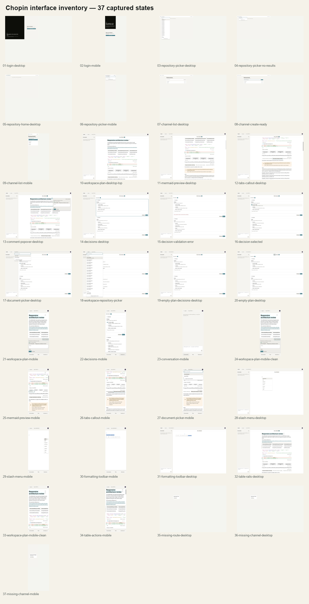
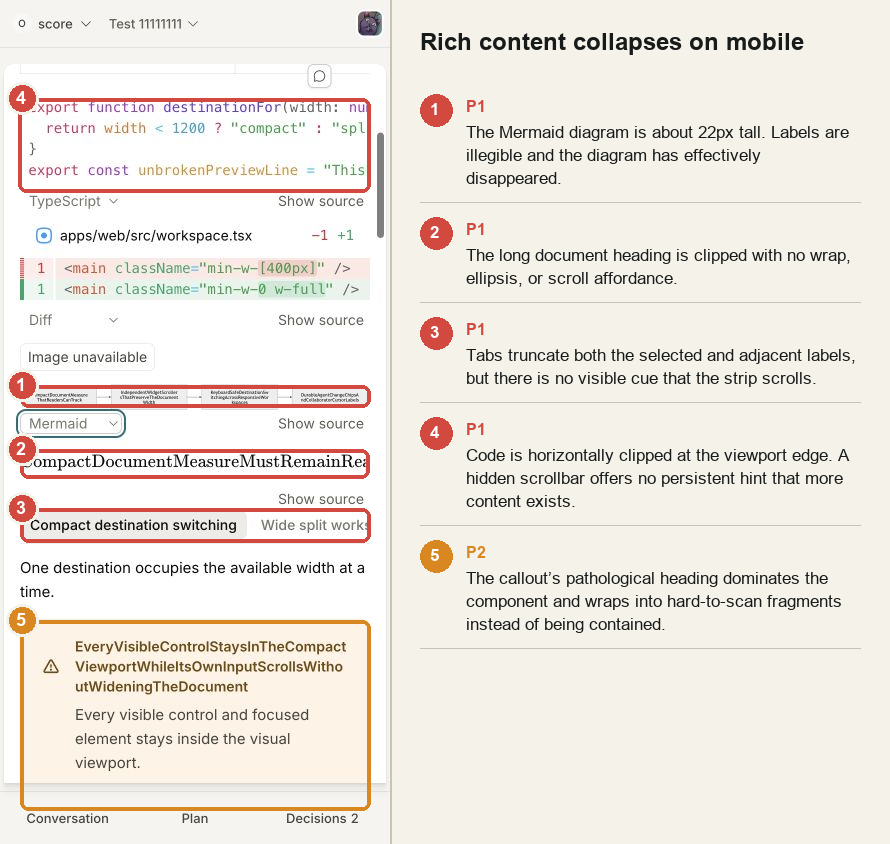
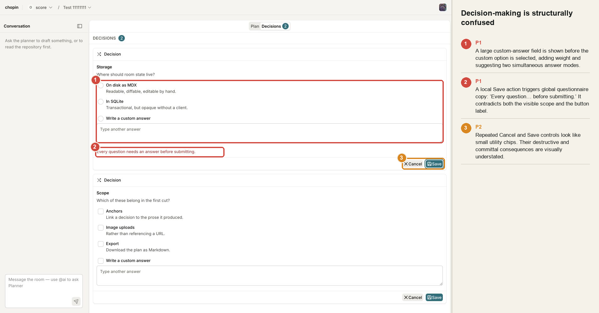
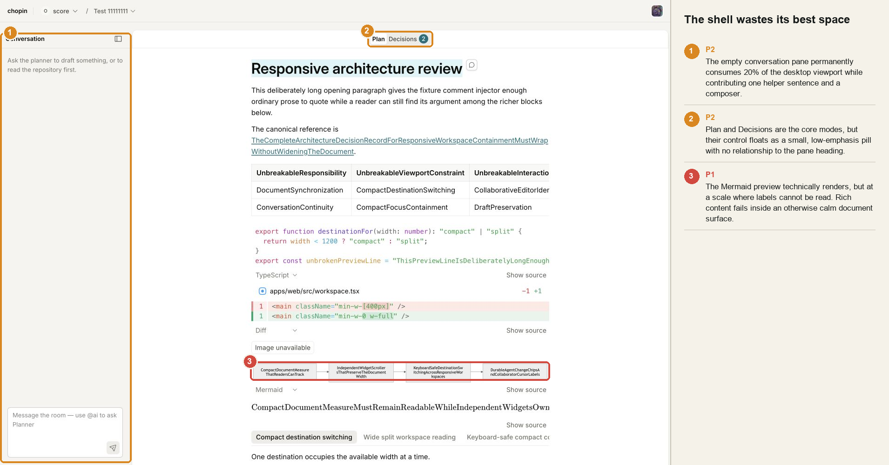
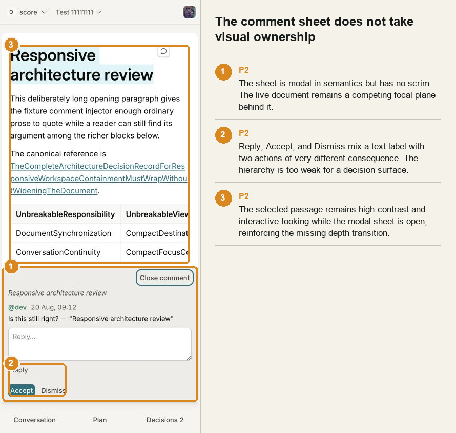
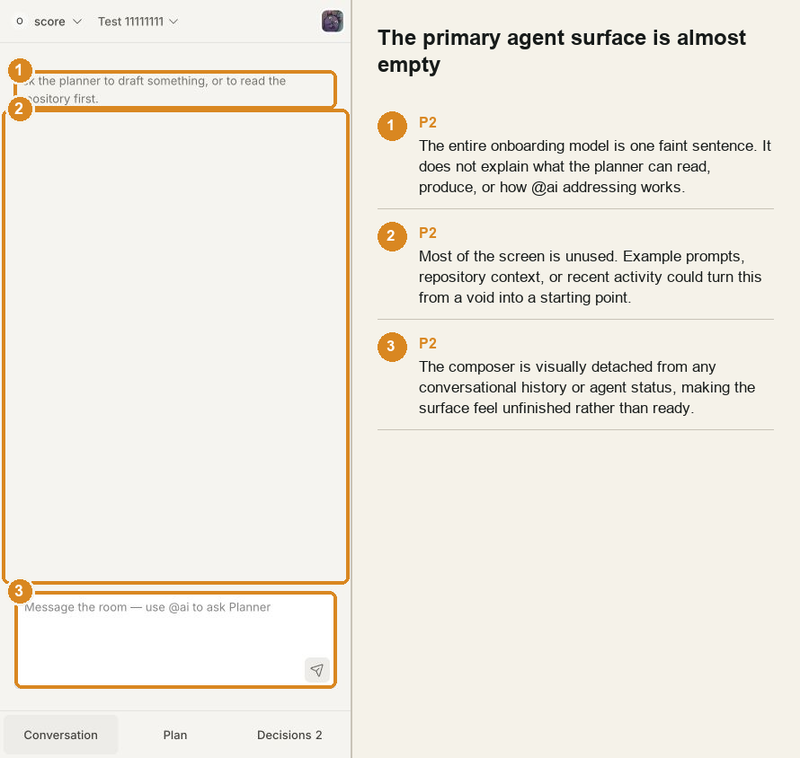
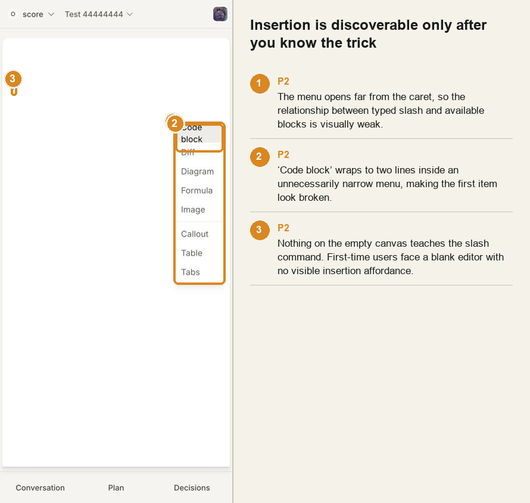
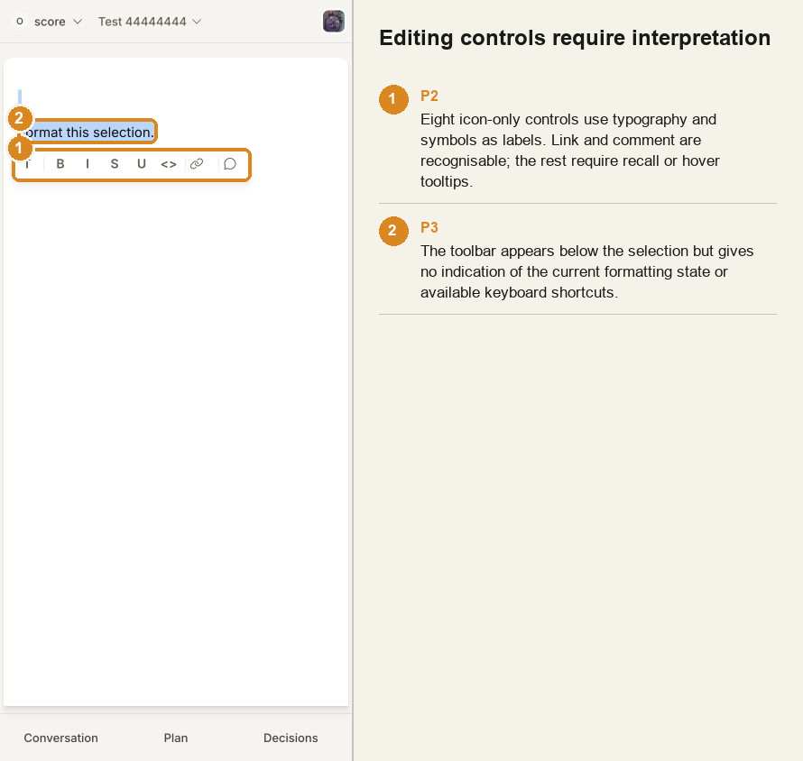
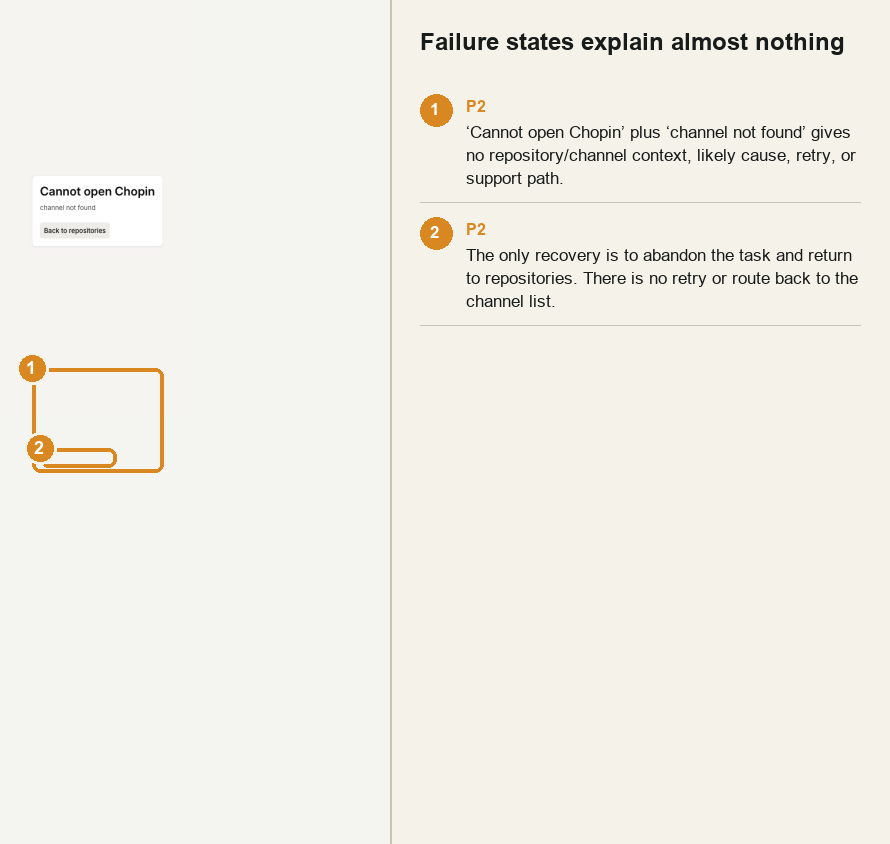

⚠️ **DEGRADED: single-context audit.** The critique method normally uses independent reviewer contexts; this run stayed uninterrupted because the brief explicitly said not to stop before the audit was complete. The screenshots, code inspection, scoring, and recommendations are complete, but the severity calibration has not been cross-checked by a second reviewer.

# Chopin interface and interaction audit

**Audited:** 20 August 2026\
**Surface:** authenticated web app, desktop at 1440 × 1000 and compact layout at 390 × 844\
**Evidence:** 37 raw states, eight annotated plates, code inspection, production build, static checks\
**Overall verdict:** **25/40 — acceptable, with three product-critical failures**

Chopin has a thoughtful technical and visual foundation. The warm neutral palette is quiet, the typography is readable, the collaboration model is unusually careful, and keyboard/focus behaviour has clearly received serious work.

But the interface breaks at the exact moment it needs to earn trust. Rich document content becomes unreadable on narrow screens. Mermaid diagrams are reduced to thumbnail-sized strips even on desktop. Decision cards use a contradictory interaction model. The conversation surface — ostensibly one of the product's three pillars — looks unfinished when it has no messages.

This is not a redesign problem yet. It is a containment, hierarchy, and interaction-contract problem. Fix the three P1 issues before adding more surface area.

## Design health score

| Nielsen heuristic               |     Score | Assessment                                                                                                                             |
| ------------------------------- | --------: | -------------------------------------------------------------------------------------------------------------------------------------- |
| Visibility of system status     |       3/4 | Connection, loading, creation, and planner states exist; empty and failure states remain too quiet.                                    |
| Match with the real world       |       3/4 | Most language is plain. “Decision”, “Plan”, and “Conversation” map well to the domain.                                                 |
| User control and freedom        |       3/4 | Editor undo, cancellation, pane controls, and escape paths are present; decision cancellation and saving are underspecified.           |
| Consistency and standards       |       3/4 | Strong shared tokens and components; popovers, sheets, cards, and mode controls do not always express consistent depth or consequence. |
| Error prevention                |       3/4 | Table limits, validation, and disabled states are strong; decision inputs invite invalid or ambiguous states.                          |
| Recognition over recall         |       2/4 | Slash insertion, icon-only formatting, hidden table rails, and `@ai` addressing depend on prior knowledge.                             |
| Flexibility and efficiency      |       3/4 | Keyboard navigation and direct manipulation are substantial; shortcut education is almost absent.                                      |
| Aesthetic and minimalist design |       2/4 | The base system is calm, but blank panes waste space while rich widgets become dense and brittle.                                      |
| Error recognition and recovery  |       2/4 | Errors are visible but generic. Recovery usually means abandoning the current task.                                                    |
| Help and documentation          |       1/4 | The product supplies fragments of helper copy, not an operating model.                                                                 |
| **Total**                       | **25/40** | **Acceptable — significant improvements required.**                                                                                    |

## Engineering audit score

| Dimension                |     Score | Assessment                                                                                                                             |
| ------------------------ | --------: | -------------------------------------------------------------------------------------------------------------------------------------- |
| Accessibility            |       2/4 | Strong semantics, focus work, and reduced-motion support; duplicate headings, weak modal depth, and recognition-heavy controls remain. |
| Performance              |       2/4 | Expensive renderers are lazy, but the initial main JavaScript chunk is 1,396,071 bytes before compression.                             |
| Responsive design        |       2/4 | The destination model is sound; the content inside the document is not reliably contained or legible.                                  |
| Theming                  |       2/4 | Tokens are coherent and disciplined, but the system is intentionally light-only and some third-party rendering looks detached.         |
| Implementation integrity |       3/4 | Architecture, tests, and explanatory comments are unusually strong. Most weaknesses are design contracts, not careless implementation. |
| **Total**                | **11/20** | **Acceptable — the system is sounder than the resulting experience.**                                                                  |

## What is already working

- The olive, cream, petrol, and ink palette gives Chopin a restrained identity without looking like a generic AI product.
- Prose typography is comfortable, and the main document surface generally feels calmer than the surrounding tools.
- Desktop split mode and compact bottom navigation share a coherent destination model.
- ARIA labelling, roving tab behaviour, focus restoration, coarse-pointer sizing, collaboration presence, and reduced-motion handling show careful implementation.
- Animation timing is mostly restrained: short ease-out transitions, meaningful pressed states, and a comprehensive reduced-motion override.
- The product distinguishes conversation, decisions, and plan content conceptually. The information architecture is stronger than the visual hierarchy currently communicating it.

## P1 — Mermaid diagrams are technically present and functionally absent

On mobile, the four-node Mermaid graph is roughly 22px tall. It is not “small”; it is unreadable. Desktop renders the same graph as a narrow row of tiny grey boxes. This reproduces the known rendering problem and raises its severity: users cannot inspect the diagram's labels or relationships at either breakpoint.

The renderer returns Mermaid's SVG unchanged in [`render-blocks.tsx`](../../packages/editor/src/widgets/render-blocks.tsx#L113), then globally applies `max-width: 100%; height: auto` in [`styles.css`](../../packages/editor/src/styles.css#L990). A wide Mermaid viewBox therefore scales the entire diagram into the available column instead of preserving a legible label scale.

**Change:** Give diagrams an explicit presentation contract: a useful minimum height, a minimum readable text scale, contained horizontal panning, and an “Open diagram” zoom/full-screen action. Measure the rendered SVG after insertion and recompute its host height. Add a regression fixture with four wide labels at both audited widths.

**Acceptance test:** Every node label remains readable without browser zoom; a diagram wider than the column scrolls or opens, rather than shrinking indefinitely.

## P1 — Narrow screens preserve the shell but lose the content

The compact destination switcher works. The document inside it does not.

- Code lines disappear beyond the right edge with no persistent overflow cue.
- Long headings clip rather than wrapping or exposing an intentional horizontal surface.
- The tab strip scrolls, but clipped labels provide no fade, scrollbar, or automatic reveal of the selected tab. The implementation is simply `overflow-x-auto` in [`tabs.tsx`](../../packages/editor/src/widgets/tabs.tsx#L60).
- Long callout titles consume most of the card and wrap into arbitrary word fragments.
- Wide table content and rail controls compete for the same narrow edge.

The raw failure is visible in [mobile Mermaid and rich content](./images/25-mermaid-preview-mobile.png), [mobile tabs and callout](./images/26-tabs-callout-mobile.png), and [mobile table editing](./images/34-table-actions-mobile.png).

**Change:** Treat every rich block as its own responsive component. Add edge fades or always-visible scrollbar affordances to horizontal regions; scroll the active tab into view; use `overflow-wrap: anywhere` for author-controlled headings; constrain callout title measure; and keep editing chrome out of the content lane. Test hostile content, not only ideal labels.

## P1 — The decision workflow contradicts itself

The cards present radio/checkbox options and a “Write a custom answer” option — then render a large editable custom-answer field whether or not that option is selected. Focusing the field silently switches modes. Visually, the user is invited to provide both kinds of answer even though the data model treats them as alternatives.

Pressing the local **Save** button produces “Every question needs an answer before submitting.” The interface says one card and Save; the error says every card and submit. The implementation confirms the mismatch: the textarea always renders in [`question-view.tsx`](../../packages/question/src/react/question-view.tsx#L175), while the submit controller validates the full questionnaire in [`use-questionnaire.ts`](../../packages/question/src/react/use-questionnaire.ts#L163).

Cancel and Save are repeated as small utility chips on every large card, further obscuring whether actions apply per question or to the questionnaire.

**Change:** Choose one action model.

1. **Questionnaire model — recommended:** all cards form one set, one persistent footer says “Submit 2 decisions”, incomplete cards are marked inline, and cancellation applies to the set.
2. **Independent-card model:** each card saves independently, errors name only that card, and the global submission requirement is removed.

In either model, collapse the custom textarea until its option is selected. Rename destructive cancellation explicitly and do not pair a floppy-disk icon with a networked, irreversible decision.

## P2 — The workspace hierarchy spends space on the least useful state

The empty conversation pane consumes about 280px on desktop. Its contents are one faint helper sentence and a composer. Meanwhile, the plan contains tables, code, diffs, diagrams, tabs, and comments that need width. This is an expensive default for an empty state.

The Plan/Decisions control is also visually detached: a tiny centred pill above the document rather than a clear pane title or mode switch. The separate “DECISIONS” header inside the decisions view creates another hierarchy level and exposes two level-two headings with the same name to assistive technology: the workspace adds a hidden heading in [`workspace.tsx`](../../apps/web/src/workspace.tsx#L404), while the decision component adds a visible one in [`decisions.tsx`](../../packages/editor/src/decisions.tsx#L119).

**Change:** Collapse the empty conversation pane by default after first orientation, or reduce it to a rail with status and an explicit “Open conversation” action. Give the document a stable header that owns Plan/Decisions once. Remove the duplicate accessible heading.

## P2 — The mobile comment sheet is modal in code, not in appearance

The compact comment card correctly declares `role="dialog"` and `aria-modal` in [`comment-layer.tsx`](../../packages/editor/src/comment-layer.tsx#L513). Visually, however, there is no scrim and almost no elevation transition. The underlying document remains high-contrast and looks available. The sheet never fully takes ownership of attention.

Reply, Accept, and Dismiss then sit together with almost equal emphasis despite having very different consequences. “Accept” starts agent work and freezes the decision; it should not look like a lightweight sibling of “Dismiss”.

**Change:** Add a subtle dimming layer, animate the sheet from its physical edge, keep close/back in a stable header, and separate conversation actions from decision actions. Use explicit labels such as “Accept and update plan” and “Dismiss suggestion” when space permits.

## P2 — The conversation surface does not explain the product

The product's login promise is “a shared document, a visible conversation, and an agent that can read the repository”. Once inside, the conversation screen is a void. One sentence asks the planner to draft something or read the repository; the composer separately says to use `@ai`. Neither explains what happens when the user does not address the planner, what repository context is available, or what good first actions look like.

**Change:** Make the empty state operational. Show three concise examples — “Summarise the current architecture”, “Draft a rollout plan”, “Ask the room a question” — plus a one-line explanation of addressed versus room messages. Once history exists, remove the examples.

## P2 — Authoring controls are precise but poorly taught

The empty editor offers no visible insertion affordance. A user must already know to type `/`. When invoked at mobile width, the menu appears far from the caret and is so narrow that “Code block” wraps to two lines.

The inline toolbar has solid accessible names and desktop tooltips, but its visual language is largely `T B I S U <>` plus two icons. This optimises for an expert who already understands the mapping. Narrow fine-pointer or hybrid devices retain the compact toolbar; true coarse-pointer mode is correctly widened by the existing implementation.

Table editing is even harder to discover. The measured rails appear as pale, nearly blank bars until the correct hover region is found. [Desktop table rails](./images/32-table-rails-desktop.png) read as rendering residue, not as draggable controls.

**Change:** Add a calm empty-block affordance, keep the slash menu anchored to the caret with a usable minimum width, show selected formatting state more strongly, and reveal table actions when the table itself is selected — not only when a hidden lane is hovered.

## P2 — Failure recovery is an exit, not a recovery

“Cannot open Chopin / channel not found” is technically accurate and practically barren. It does not name the repository or requested channel, distinguish deletion from lost access, offer retry, or return to the repository's channel list. The only action abandons the current context and returns to all repositories. The generic implementation is in [`hosted.tsx`](../../apps/web/src/hosted.tsx#L100).

**Change:** Preserve context in the error surface: name the repository/channel, include a retry action for recoverable failures, link to that repository's channel list, and reserve “Back to repositories” as the secondary escape.

## P2 — The initial JavaScript budget is too large for the visible first screen

The production build succeeds, but emits a **1,396,071-byte main JavaScript chunk** before compression and warns about chunks over 500k. Mermaid is separately chunked at roughly 498k, with Cytoscape around 443k and additional layout modules. Lazy loading the specialist renderers is the right choice; the main shell still carries too much for login, repository selection, and channel browsing.

**Change:** Set route-level and workspace-level budgets. Split hosted/login surfaces from the editor, audit the main bundle's largest transitive imports, and prefetch editor code only after a channel is selected. Measure cold load on a mid-range phone, not only local desktop.

## P3 polish findings

- **Login:** The black brand panel is confident, but the actual product story is stranded in the bottom-left while the GitHub action floats in a large empty field. On mobile the two blocks stack without a stronger narrative bridge. See [desktop](./images/01-login-desktop.png) and [mobile](./images/02-login-mobile.png).
- **Repository picker:** A very long flat list has no grouping, recency, installation identity, or sticky query. Private status is visually inconsistent across rows. See [repository picker](./images/03-repository-picker-desktop.png).
- **Channel list:** Names and dates are insufficient for triage. There is no activity, decision count, participant, planner status, or description. The create field relies on placeholder text for its visible label. See [desktop](./images/07-channel-list-desktop.png) and [mobile](./images/09-channel-list-mobile.png).
- **Desktop comments:** The popover covers document content rather than negotiating space with it. Close is a text link in the far corner, while the consequential actions sit at the bottom without a strong footer. See [comment popover](./images/13-comment-popover-desktop.png).
- **Context-menu motion:** The callout menu uses an entrance animation in [`callout.css`](../../packages/editor/src/callout.css#L154). Contextual menus should feel immediate; reserve visible motion for spatial transitions such as the mobile sheet.
- **Exit motion:** Most transient surfaces mount with a short entrance but disappear instantly. This is not a speed problem; it is an object-continuity problem. Pair 120–200ms entrance and exit transitions where the surface has spatial meaning.

## Motion review against the 12 principles

| Principle                     | Assessment                                                                                           |
| ----------------------------- | ---------------------------------------------------------------------------------------------------- |
| Squash and stretch            | Restrained pressed-scale states communicate physical response without cartooning. Good.              |
| Anticipation                  | Weak around hidden authoring controls; nothing anticipates slash insertion or table rails.           |
| Staging                       | Strong in the base shell, weak when comment sheets omit a scrim or rich content crowds the document. |
| Straight ahead / pose-to-pose | State transitions are deterministic and component-driven. Good.                                      |
| Follow-through                | Transient surfaces often vanish without an exit state. Needs work.                                   |
| Slow in / slow out            | Consistent ease-out curves and short durations are appropriate. Good.                                |
| Arcs                          | Not materially applicable to current motion.                                                         |
| Secondary action              | Agent marks, cursor labels, and activity counts support primary actions without dominating. Good.    |
| Timing                        | Mostly 120–200ms; spinner is correctly linear. Context-menu entrance is unnecessary.                 |
| Exaggeration                  | Appropriately minimal for a collaborative planning tool.                                             |
| Solid drawing                 | Depth is coherent on popovers; the mobile sheet loses depth because the background is undimmed.      |
| Appeal                        | Calm and professional at rest; brittle rich content and empty surfaces reduce confidence.            |

The global reduced-motion override in [`styles.css`](../../packages/editor/src/styles.css#L847) is exemplary. Preserve it while improving object continuity.

## Accessibility notes

The implementation is stronger than the screenshots alone suggest. Dialog roles, labels, focus restoration, keyboard tab semantics, pointer-modality sizing, and reduced motion are present. The remaining issues are specific:

1. Two “Decisions” level-two headings name the same visible region.
2. The compact comment dialog is semantically modal but lacks the expected visual modality.
3. Icon-only editing controls depend heavily on tooltips, which do not help touch or switch users learn the mapping.
4. Clipped author content can become effectively inaccessible even when the DOM remains valid.
5. Error recovery provides too few routes for users who cannot infer whether the cause is navigation, permissions, or deletion.

## Cognitive-load review

The interface fails four of the five high-level checks in its complex states:

- **Single focus:** document, empty conversation pane, decisions control, comments, and editing chrome compete.
- **Clear hierarchy:** the shell is clear; decision cards and rich widgets are not.
- **Working-memory demand:** users must remember slash commands, `@ai`, icon meanings, and whether Save applies locally or globally.
- **Progressive disclosure:** custom textareas and editing rails are either always present at full weight or hidden too aggressively.
- **Choice count:** generally controlled; the slash menu is short and sensibly grouped.

## Three user journeys

### Jordan — first-time collaborator

Jordan understands the login promise, then lands in a repository and channel system with very little explanation. Inside a channel, the empty conversation surface does not teach the distinction between room conversation and planner instructions. Jordan can read the plan but is unlikely to discover rich insertion or understand why `@ai` matters.

**Likely outcome:** passive reading rather than confident collaboration.

### Alex — expert technical author

Alex quickly discovers slash insertion and keyboard formatting. Desktop authoring feels fast until a diagram, wide code sample, table, or long tab label enters the document. Then layout containment and hidden controls become the limiting factor rather than authoring speed.

**Likely outcome:** high initial enthusiasm, followed by distrust of rich blocks.

### Sam — keyboard and assistive-technology user

Sam benefits from substantial semantic and focus work. They can navigate tabs, dialogs, and destinations. Duplicate “Decisions” headings, icon semantics that are visually opaque to collaborators, and content that clips without a clear scroll route undermine an otherwise unusually accessible foundation.

**Likely outcome:** the app is operable, but not consistently understandable.

## Emotional journey

| Moment                       | Likely feeling            | Why                                                                                                          |
| ---------------------------- | ------------------------- | ------------------------------------------------------------------------------------------------------------ |
| Login                        | Calm, mildly curious      | The promise is concise and the palette feels deliberate.                                                     |
| Repository/channel selection | Under-informed            | Lists expose names, but little context for choosing.                                                         |
| First workspace view         | Impressed, then uncertain | The document looks serious; the empty conversation and tiny mode control do not explain the operating model. |
| Rich-content reading         | Frustrated                | Diagrams, headings, tabs, and code become unreadable or clipped.                                             |
| Answering decisions          | Anxious                   | It is unclear what Save and Cancel apply to, or why a local action demands every answer.                     |
| Error state                  | Abandoned                 | The only route is out of the current task.                                                                   |

## Full screenshot inventory

The fixtures exercised authentication, repository discovery, channel creation, populated and empty plans, Plan/Decisions/Conversation destinations, comments, questionnaire states, document selection, rich blocks, authoring controls, tables, and failure routes at desktop and compact widths.

| Area                    | Captured states                                                                                                                                                                                                                                                                       |
| ----------------------- | ------------------------------------------------------------------------------------------------------------------------------------------------------------------------------------------------------------------------------------------------------------------------------------- |
| Authentication          | [01 desktop login](./images/01-login-desktop.png), [02 mobile login](./images/02-login-mobile.png)                                                                                                                                                                                    |
| Repository discovery    | [03 picker](./images/03-repository-picker-desktop.png), [04 no results](./images/04-repository-picker-no-results.png), [05 home](./images/05-repository-home-desktop.png), [06 mobile picker](./images/06-repository-picker-mobile.png)                                               |
| Channels                | [07 list](./images/07-channel-list-desktop.png), [08 creation ready](./images/08-channel-create-ready.png), [09 mobile list](./images/09-channel-list-mobile.png)                                                                                                                     |
| Desktop workspace       | [10 top](./images/10-workspace-plan-desktop-top.png), [11 Mermaid](./images/11-mermaid-preview-desktop.png), [12 tabs/callout](./images/12-tabs-callout-desktop.png)                                                                                                                  |
| Comments                | [13 desktop popover](./images/13-comment-popover-desktop.png), [21 mobile sheet](./images/21-workspace-plan-mobile.png)                                                                                                                                                               |
| Decisions               | [14 default](./images/14-decisions-desktop.png), [15 validation](./images/15-decision-validation-error.png), [16 selected](./images/16-decision-selected.png), [19 empty-plan decisions](./images/19-empty-plan-decisions-desktop.png), [22 mobile](./images/22-decisions-mobile.png) |
| Document navigation     | [17 document picker](./images/17-document-picker-desktop.png), [18 repository picker in workspace](./images/18-workspace-repository-picker.png), [27 mobile picker](./images/27-document-picker-mobile.png)                                                                           |
| Empty plan/conversation | [20 empty plan](./images/20-empty-plan-desktop.png), [23 mobile conversation](./images/23-conversation-mobile.png)                                                                                                                                                                    |
| Compact rich content    | [24 plan with comment](./images/24-workspace-plan-mobile-clean.png), [25 Mermaid/code](./images/25-mermaid-preview-mobile.png), [26 tabs/callout](./images/26-tabs-callout-mobile.png), [33 clean plan](./images/33-workspace-plan-mobile-clean.png)                                  |
| Insertion/formatting    | [28 desktop slash](./images/28-slash-menu-desktop.png), [29 mobile slash](./images/29-slash-menu-mobile.png), [30 mobile toolbar](./images/30-formatting-toolbar-mobile.png), [31 desktop toolbar](./images/31-formatting-toolbar-desktop.png)                                        |
| Tables                  | [32 desktop rails](./images/32-table-rails-desktop.png), [34 narrow table selection](./images/34-table-actions-mobile.png)                                                                                                                                                            |
| Failure routes          | [35 missing route](./images/35-missing-route-desktop.png), [36 missing channel desktop](./images/36-missing-channel-desktop.png), [37 missing channel mobile](./images/37-missing-channel-mobile.png)                                                                                 |

Screenshots 21 and 24 intentionally show the compact comment sheet. Screenshot 33 is the clean compact plan. Repeated question counts and duplicate comment buttons in later captures were caused by development fixtures reinjecting on reopen; they are excluded from the product findings.

## Prioritised remediation

### Now — restore trust

1. Fix Mermaid sizing and add zoom/pan/full-screen behaviour.
2. Contain hostile rich content across code, tabs, headings, callouts, and tables.
3. Redesign decisions around one clear save/submit scope and progressive custom answers.

### Next — clarify the product

4. Build an operational conversation empty state and explain `@ai` versus room messages.
5. Rebalance desktop workspace width and consolidate the Plan/Decisions hierarchy.
6. Add a real modal depth transition and stronger action language to comment sheets.
7. Improve error recovery with context, retry, and channel-list navigation.

### Then — improve craft and speed

8. Teach slash insertion and reveal table tools from selection, not hover hunting.
9. Add route-level bundle splitting and performance budgets.
10. Refine login, repository, and channel surfaces with more useful context and denser desktop composition.
11. Pair entrance and exit motion where spatial continuity matters; remove it from context menus.

## Questions to resolve before redesign

1. Is a decision saved independently, or is a questionnaire submitted as one transaction? The interface currently claims both.
2. Should Conversation be the default desktop companion even when empty, or should document width win until the room has activity?
3. Are rich blocks expected to be presentation-quality artefacts, or editable source with an optional preview? Mermaid currently tries to be both and succeeds at neither scale.

## Method and limits

- The app ran against a disposable PostgreSQL database with the repository's fake GitHub network boundary and seeded E2E fixtures. No real GitHub login was required.
- `AGENT=off` was necessary because production agent credentials were not available. Live agent streaming, permission denials, planner cursor movement, and post-turn marks were therefore not visually audited. Their implementation was inspected but they are outside the screenshot claims.
- The production client built successfully. `bun run ci` completed with zero warnings or errors across 293 files.
- The Impeccable static detector ran in degraded regex mode because its optional HTML parser modules were unavailable. It found no issues in `apps/web`; its only editor warning was the intentional blockquote side border, treated as a false positive.
- Browser inspection used the supported read-only automation interface. Runtime overlay injection was unavailable, so every visual finding was verified manually from the live rendered UI rather than from an injected audit overlay.
