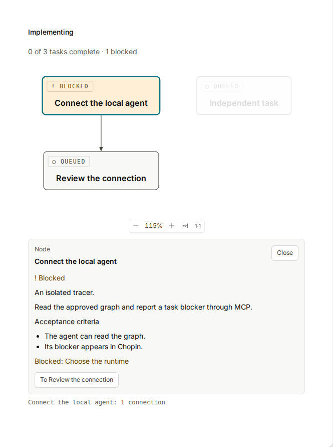

# Local implementation tracer

“Build on my laptop” launches an implementation through the same
[ACP connector used for investigations](local-experiments.md). Chopin displays
tasks, dependencies, blockers and per-task PR links. The connector claims the
approved graph before prompting the coding agent; a completed ACP turn is
separate from passing implementation verification.

## Connect a workspace

Authenticate an ACP-compatible coding agent normally, then connect a checkout:

```sh
CHOPIN_URL=https://your-chopin-instance.example \
  bun run connector connect /absolute/path/to/project -- copilot --acp
```

Open the printed pairing link, sign into Chopin, choose the document and select
**Connect**. This is the existing investigation pairing flow. No GitHub bearer
needs to be configured in a second companion. The connector credential is held
in memory and tied to the owner's browser login. Reconnect after a server
restart or logout.

Keep the connector running. Each browser Build action starts an agent process;
automatically installing or starting the connector itself remains future work.
Standard ACP permission requests appear in its terminal and are declined when
no interactive terminal is available. The agent retains its normal tools,
project instructions and configured services.

## Build a settled plan

1. Resolve planning questions and accepted comments awaiting document updates.
   Build lists them as links until they are done.
2. Open **Build** beside Document and Decisions. When the tasks are missing or
   older than the document, opening Build asks the hosted Planner to draft them
   without posting a Chat message, once per visit; it waits if the Planner is
   already working. See
   [drafting tasks from Build](implementation-lifecycle.md#drafting-tasks-from-build).
3. Once tasks exist, **Task graph** appears beside Decisions. Review the dependency
   diagram and select nodes for context, goals, acceptance criteria and dependencies.
   To change tasks, ask Chopin in Chat or open Build to update an out-of-date graph.
4. Select **Build on my laptop** in Task graph or Build. Task graph lets you choose
   your connected workspace and review its branch and commit; Build uses your first
   available workspace. Without one, the view shows the connector command to start, and you
   select it again once connected. Approval persists the reviewed document and
   graph counters, checkout commit and connection owner, then freezes planning
   edits.
5. The connector creates an isolated worktree at that exact commit and an
   implementation branch, preserving existing local edits. It creates an ACP
   session and claims the graph before prompting the orchestrator.
6. The orchestrator is instructed to use sub-agents for independent ready tasks,
   integrate prerequisites and open small reviewable PRs linked to the document
   and task anchors. It owns all task and verification reporting.

The agent's run-scoped MCP connection exposes only `read_implementation` and the seven
existing lifecycle reporting tools. The run credential fixes the document and
run; those IDs are not agent-supplied arguments. The connector's credential
controls pickup and heartbeat. Investigations and implementations share the
same workspace busy check. The connector uses HTTP MCP when advertised by the
ACP agent, falling back to the stdio bridge otherwise. This also makes the
investigation tools available to Copilot ACP versions that reject stdio MCP.

Build and Task graph load snapshots when opened and refresh on document,
workspace and implementation notifications. They do not poll in the background
and occupy the same workspace pane as Document and Decisions. Leaving either does
not stop a run, and editing
locks continue to update through the document socket. A `#task-<id>` link opens
Build with that task expanded.

Task graph follows the whole implementation: queued and starting dispatches,
active work, interruptions, and verified outcomes. Nodes show reported task status;
selection reveals blockers, completion summaries and PR links. Finishing all tasks
is shown as awaiting verification while the run is active; **Verified** follows
passing graph-wide verification. Progress survives refresh, while inspection and
zoom stay local to the reader. Out-of-date graphs remain readable with a notice.
Repository readers can inspect the graph and progress; starting a build requires
write access and the person's own paired workspace.



Duplicate Build requests for the same owner, workspace and reviewed graph return
the same durable intent. A picked-up build is never automatically replayed.
Refresh retains task progress, blockers, session
identity and reported PRs. Expired connections or missing heartbeats mark tracked
builds as needing attention; after a server restart, opening the document tracks
its retained build again.

## Current limits and recovery

This slice uses ACP agents. It removes the separate Codex App Server launcher;
an agent without ACP support needs an adapter. Scheduling and sub-agent use are
orchestrator instructions, not a server scheduler. The opt-in live tracer checks
MCP reporting; it does not prove delivery of a complete multi-PR implementation.

New implementation decisions appear as task blockers. Configurable decision
policy, human resolution/resume controls, automatic connector startup and a
browser PR-creation action remain future work. Multiple reported PRs already
appear beside their tasks; Chopin never merges them automatically.

Inspect failures in the connector terminal and retained worktree. If startup
failed before the graph was claimed, **Try again** creates a
new attempt after another explicit review. Repeating that retry request returns
the same attempt; it does not start duplicate work.

If a claimed run stops or fails, its graph remains locked. After inspecting the
retained checkout, choose **Return to planning**, enter a reason and confirm to
record a revision request and release the editing lock. Opening Build then asks
the Planner to revise the tasks; review the replacement before building again.
This action is unavailable while the agent is still running; stop the connector
in its terminal first. An admitted
repository writer can also continue the existing lifecycle through ordinary
`/mcp`. The connector's run credential stops accepting reports when its turn ends.
Failure does not undo local edits, and these controls do not automatically resume
an interrupted agent session.

## Verification

```sh
bun run e2e e2e/implementation-launcher.e2e.ts e2e/connector.e2e.ts
```

The scripted ACP tests exercise real browser pairing, the production connector,
worktree creation, scoped MCP claims, persisted blockers and two reported PRs
through successful verification. GitHub responses and the ACP agent are fixtures;
they do not create real GitHub PRs.

Set `CHOPIN_TEST_ACP_COMMAND` to a JSON array containing your agent's ACP command
to enable the additional live test. It uses local credentials and model usage to
read the approved graph and report a blocker. It changes disposable test state
and does not implement code or create PRs.
