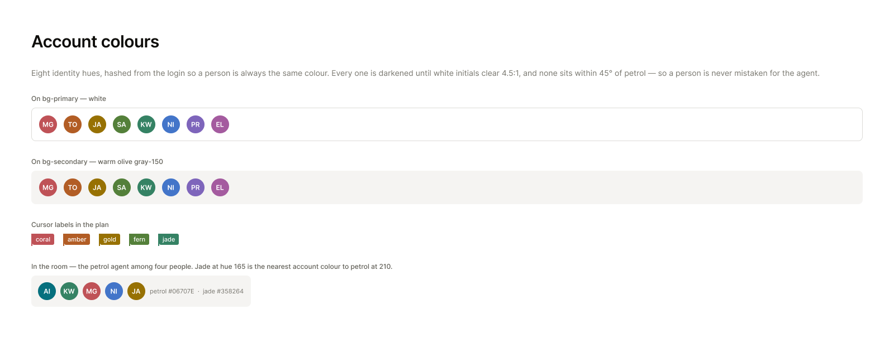
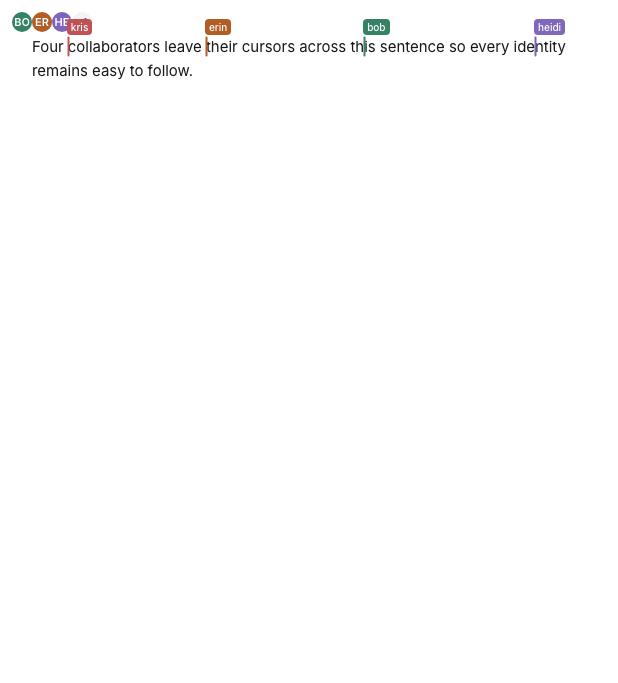
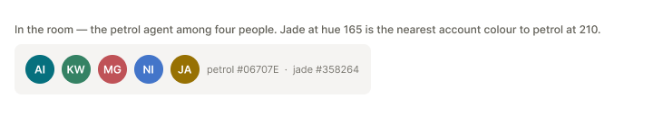

## Context

The hues were designed on canvas, and the canvas is readable over MCP — open
the frame rather than working from the image.

- Account colours — https://www.figma.com/design/Px4tP6QSzRgNe6St0Yah64?node-id=16-2

The eight colours identifying people in cursors and avatar fallbacks are One
Dark syntax values — drawn for code on charcoal, not for identity chips on a
near-white surface. They read muddy in the app.

## Goal

Replace them with eight hues designed for this surface, each dark enough to
carry white text on a cursor label.

## Notes

The replacements, in order:

coral `#BF5257`, amber `#B25D25`, gold `#977103`, fern `#54803A`,
jade `#358264`, cobalt `#4375C9`, violet `#7E65BB`, fuchsia `#A45B9F`

Every one clears 4.48:1 against white text. Gold measures 4.488:1 — accepted as
close enough to the 4.5:1 target — and the others clear 4.5:1.

Keep the login hash exactly as it is. Colour is derived from the login so that
everyone in a room sees the same person in the same colour — order-based
assignment would give each client a different mapping.

Jade sits closest to the petrol brand and is kept deliberately. 009 removes
the "AI" lettering, so the agent is a plain petrol mark and a person assigned
jade is a plain jade one — but 009 also gives them different shapes, a circle
for the agent and a rounded square for a person, so the two no longer collide
on colour alone. A coloured mark is the fallback in any case, and most faces
are photographs. Keep jade rather than moving it;
avatars are expected to regain a photograph or a mark later, which closes the
question on its own. If it does become a problem before then, move jade
toward hue 145 rather than dropping it.

Independent of the token rebuild — this palette is a TypeScript array, not a
CSS token, and does not read the theme.

## Acceptance

- [ ] The palette contains exactly the eight values listed in Notes
- [ ] No One Dark value remains in the palette
- [ ] Every colour measures at least 4.48:1 against white; seven clear 4.5:1
- [ ] The same login yields the same colour on two different clients
- [ ] The avatar fallback circle and remote cursor labels both draw from the
      palette
- [ ] A screenshot of four remote cursors in the document, and one of a
      facepile including the agent, attached to the PR

## Evidence

`packages/editor/src/cursor.ts` remains the one source for both surfaces: the
app passes `cursor(handle)` into collaboration, while both fallback avatar
components call `color(handle)` directly. The hash itself is unchanged.

The cursor picture is from five real browser pages in one room. GitHub avatar
requests were refused so the presence pile exercised its coloured fallback
rather than whatever photograph a handle happens to have.

The facepile is cropped from the linked foundations frame. Its shapes and
lettering deliberately remain as drawn here; 009 owns those changes.
