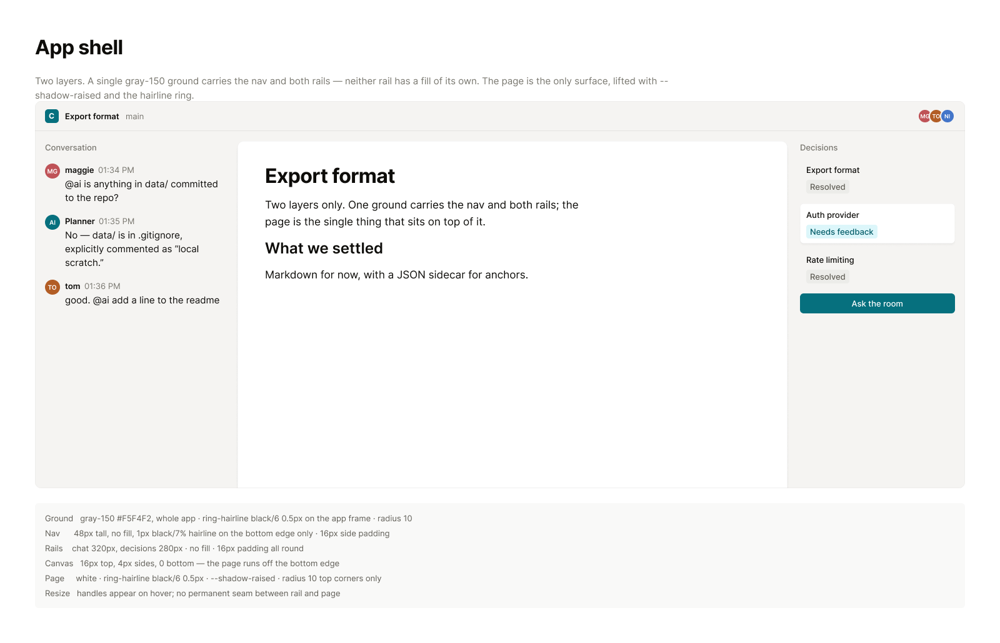
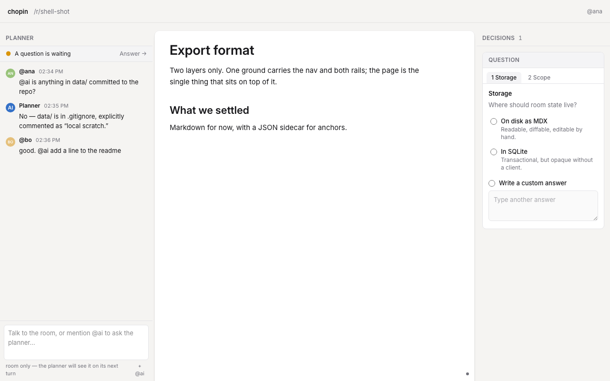
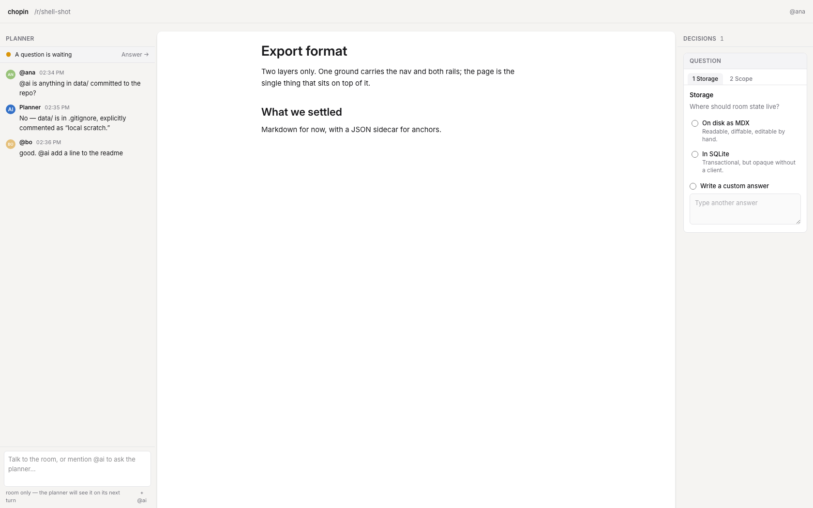

## Context

The shell was designed on canvas, and the canvas is readable over MCP — open
the frame rather than working from the image.

- App shell — https://www.figma.com/design/Px4tP6QSzRgNe6St0Yah64?node-id=35-2

Today the three panes are separate surfaces separated by borders and a gap,
with the ground showing between them.

## Goal

Reduce the shell to two layers: one ground carrying the nav and both rails,
and the document page as the only surface sitting on it.

## Notes

The rails stop being panels. They have no fill, no border and no shadow — they
are content laid directly on the ground, and the ground runs unbroken behind
the nav, both rails and the space around the page.

Rejected, and why:

- Flush panes each with their own fill and a hairline seam at every join.
  Three greys and two seam rules to justify, and nothing read as the subject.
- Panes as separate cards with the ground showing in a gap between them. Two
  mechanisms doing one job, and the gap made the app look assembled.

Resize handles appear on hover rather than being permanently drawn. There is
no seam between rail and page to grab, so the affordance has to arrive with
the pointer — but it must still be reachable without one.

Neither rail collapses today and this task does not add that. Build the rails
so a collapsed state could be added later without restructuring — the ground
already runs behind them, so collapsing one should be a width change rather
than a change of surface.

Depends on 003 — the ground, ring and shadow it needs are defined there.

## Acceptance

Layers

- [ ] The nav and both rails have no background fill of their own
- [ ] A single gray-150 ground runs behind the nav, both rails and the page
- [ ] The document page is the only element with a shadow

Page

- [ ] The page is white with the hairline ring and the raised shadow
- [ ] The page has 4px of ground on its left and right
- [ ] The page runs off the bottom of the viewport rather than ending above it
- [ ] The page's top two corners are rounded and its bottom two are not

Nav

- [ ] The nav is 48px tall with a hairline on its bottom edge only
- [ ] There is 16px between the nav and the top of the page

Resize

- [ ] Neither resize handle is visible until the pointer is over its boundary
- [ ] Both rails can be resized using only the keyboard

Evidence

- [ ] Screenshots at 1280px and 1680px wide attached to the PR

## Evidence

