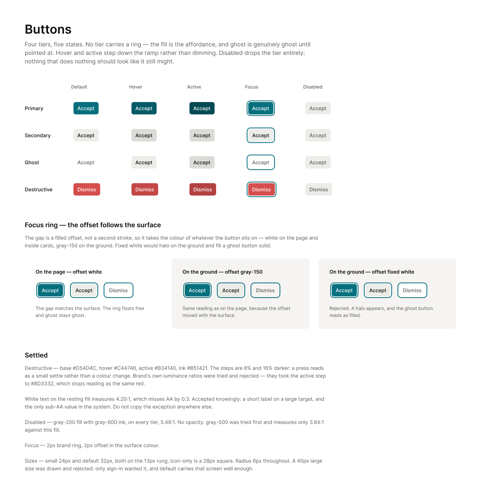
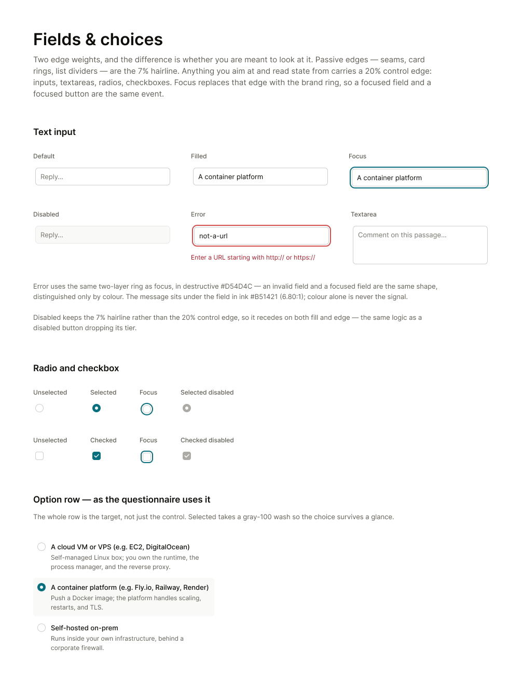
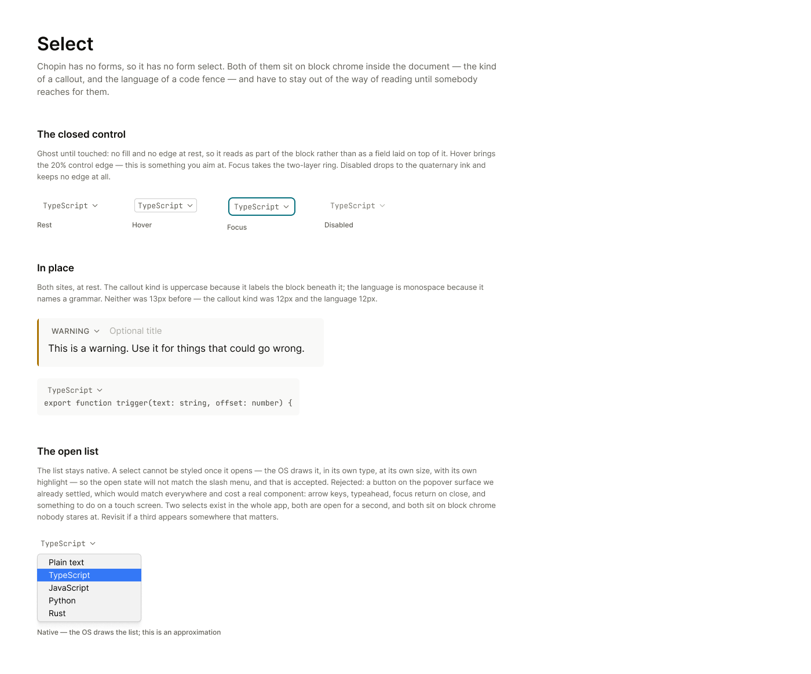

## Context

Every value below is on the canvas, and the canvas is readable over MCP —
open the frames rather than working from the images, which are here only so
the shape is visible at a glance.

- Buttons — https://www.figma.com/design/Px4tP6QSzRgNe6St0Yah64?node-id=54-2
- Buttons, sizes — https://www.figma.com/design/Px4tP6QSzRgNe6St0Yah64?node-id=63-2
- Fields & choices — https://www.figma.com/design/Px4tP6QSzRgNe6St0Yah64?node-id=56-2
- Select — https://www.figma.com/design/Px4tP6QSzRgNe6St0Yah64?node-id=76-2

Today every control carries a solid grey border, disabled is an opacity
value, and there are three button sizes that differ by two pixels.

## Goal

Put every control a person operates — buttons, text fields, textareas,
checkboxes, radios and both selects — onto the designed tiers, sizes, states
and edges.

## Notes

Four button tiers, five states. No tier carries a ring; the fill is the
affordance, and ghost is genuinely ghost until pointed at. Hover and active
step down the ramp rather than dimming.

Disabled drops the tier entirely — gray-200 fill, gray-600 ink, on every tier.
Nothing that does nothing should look like it still might. gray-500 was tried
first and measures only 3.84:1 against that fill. No opacity anywhere.

The focus ring is two layers: a 2px brand ring with a 2px gap. The gap is a
filled offset rather than a second stroke, so it takes the colour of whatever
the button is sitting on — white on the page, gray-150 on the ground. Fixed
white was tried and rejected: it halos on the ground and fills a ghost button
solid.

Destructive steps are 8% and 16% darker, so a press reads as a settle rather
than a colour change. Brand's own luminance ratios were tried and rejected —
they took the active step to a red that stops reading as the same colour.
White on the resting destructive fill measures 4.20:1, missing AA by 0.3.
Accepted knowingly for a short label on a large target. It is the only
sub-AA value in the system; do not copy the exception anywhere else.

Two sizes only. The size changes the padding, never the type — a button is
not a place to introduce a sixth text size. A 40px large size was drawn and
rejected: only sign-in wanted it. 24px and 28px are both under the 44px touch
minimum, which is deliberate for a pointer-driven desktop app and the first
thing to revisit if Chopin ever gains a touch surface.

Fields take the 20% control edge because they are aimed at; a disabled one
falls back to the 7% hairline so it recedes on its edge as well as its fill.
Error uses the same two-layer ring as focus, in destructive, so an invalid
field and a focused field are the same shape distinguished only by colour —
and the message beneath it means colour is never the only signal.

On a checkbox and radio the whole row is the target, not just the control.

Both selects keep their native dropdown. A select cannot be styled once it
opens, so the open list will not match the app's own menus, and that is
accepted rather than overlooked — replacing it would cost arrow keys,
typeahead, focus return and a touch story for two controls that are open for
a second each.

Depends on 003 — the palette, the type rungs and the two edge tokens are
defined there.

## Acceptance

- [x] Exactly two button sizes exist, 24px and 32px, both at 13px, and an
      icon-only button is a 28px square
- [x] No button of any tier renders a border at rest
- [x] A disabled control renders gray-200 with gray-600 ink, and no opacity
      value is used to disable anything
- [x] A focused control shows a 2px brand ring with a 2px gap, and that gap
      matches the surface on both the white page and the gray-150 ground
- [x] Destructive rests at `#D54D4C`, hovers to `#C44746` and presses to
      `#B34140`
- [x] Text inputs, textareas, checkboxes and radios carry the 20% edge, and a
      disabled one carries 7%
- [x] A checked checkbox shows a check glyph, not a dash or a filled square
- [x] An invalid field shows the focus ring's shape in `#D54D4C` with its
      message beneath it in `#B51421`
- [x] Neither select renders a border at rest, and both show the 20% edge on
      hover
- [x] Screenshots of the chat composer, a comment card's buttons and a
      focused text field attached to the PR
