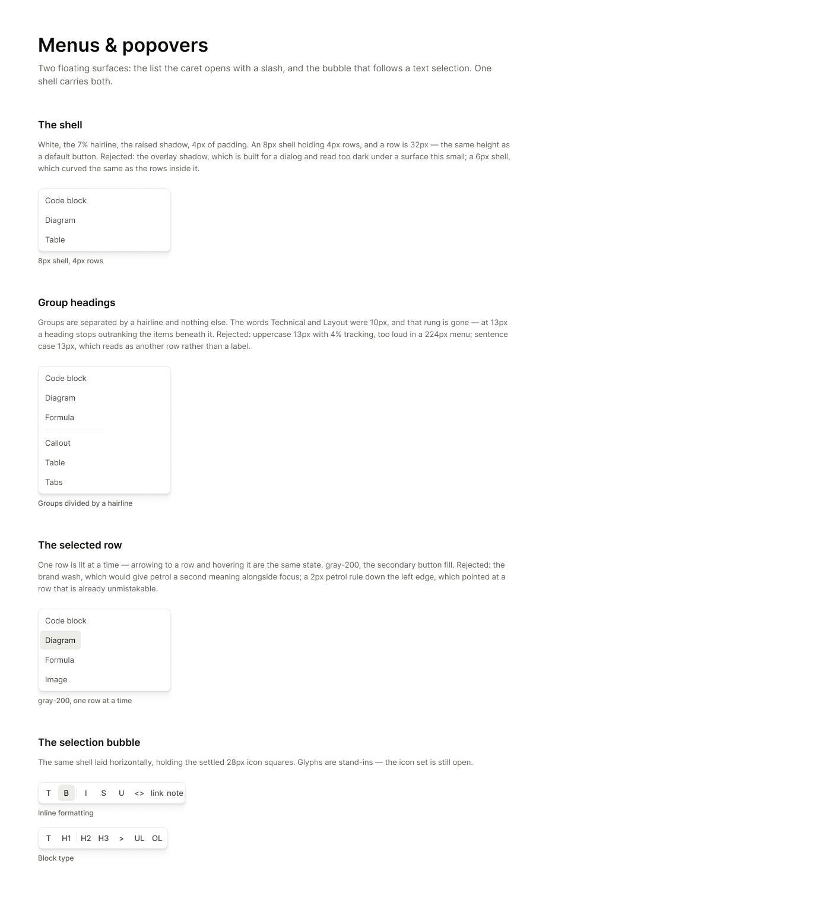
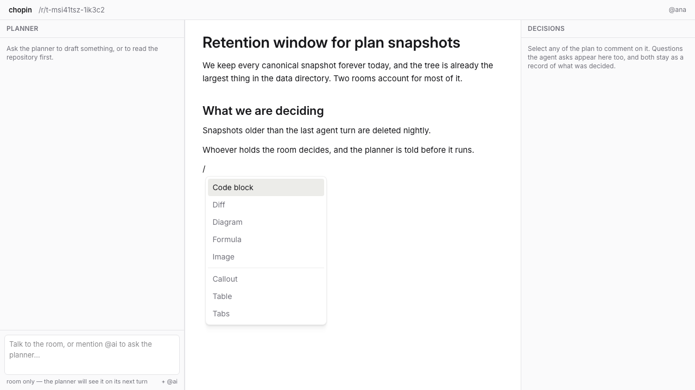
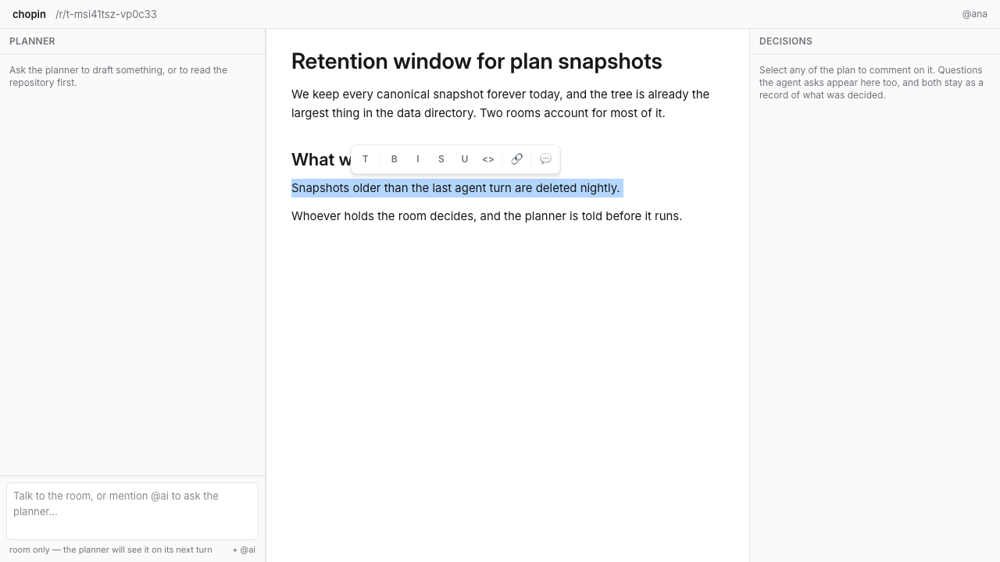

## Context

Every value is on the canvas, and the canvas is readable over MCP — open the
frame rather than working from the image.

- Menus & popovers — https://www.figma.com/design/Px4tP6QSzRgNe6St0Yah64?node-id=66-2

The two floating surfaces are styled separately today and agree only by
accident.

## Goal

Put the slash menu and the selection bubble on one shared shell, and replace
the slash menu's group headings with hairline dividers.

## Notes

One shell carries both: white, the 7% hairline, the raised shadow, an 8px
radius and 4px of padding, holding 32px rows on a 4px radius. A row is the
same height as a default button, which is where that number comes from.

The overlay shadow was tried and rejected — it is built for a dialog and
reads too dark under a surface this small. A 6px shell was rejected for
curving the same as the rows inside it.

The group headings go. Technical and Layout were 10px, and that rung no
longer exists — at 13px a heading stops outranking the items beneath it.
Uppercase 13px with tracking was tried and is too loud in a 224px menu;
sentence case 13px reads as another row rather than a label. A hairline
between the groups says the same thing and says it quietly.

The highlighted row is gray-200, the secondary button fill. Arrowing to a row
and hovering it are the same state — there is only ever one lit row. The
brand wash was rejected because it would give petrol a second meaning
alongside focus, and a petrol rule down the left edge was rejected for
pointing at a row that is already unmistakable.

The bubble holds the 28px icon squares settled in 007, so it lands on top of
it. The icons themselves are still text abbreviations and stay that way here
— replacing them with a real icon set is separate work and out of scope.

Depends on 003 and 007.

## Acceptance

- [x] The slash menu and the selection bubble render the same shell: white,
      the 7% hairline, the raised shadow, an 8px radius and 4px of padding
- [x] Neither surface uses the overlay shadow
- [x] The slash menu contains no group heading text, and its two groups are
      separated by a 7% hairline
- [x] A menu row is 32px tall on a 4px radius
- [x] The highlighted row is gray-200, and arrowing to a row looks identical
      to hovering it
- [x] Every button in the selection bubble is a 28px square
- [x] Screenshots of the slash menu open over a plan and the bubble over a
      selected sentence attached to the PR

## Evidence

## Outcome

Merged in [PR #26](https://github.com/githubnext/chopin/pull/26). The slash menu
and selection toolbar now share one surface definition, while keeping their own
layout and roles. Filtering also resets the active menu option so Enter cannot
select an item that is no longer visible.
