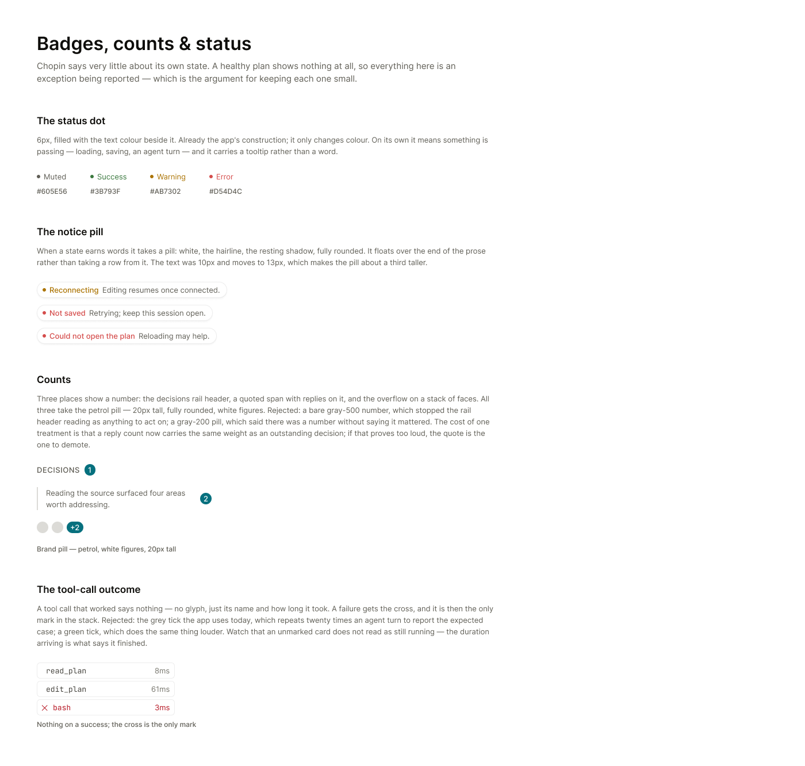
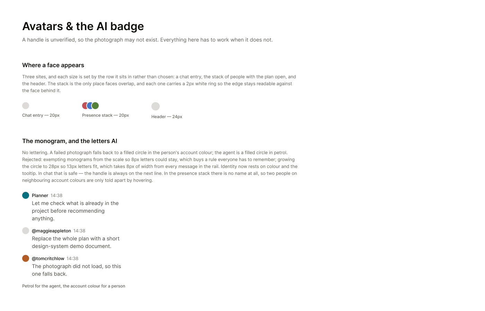

## Context

Every value is on the canvas, and the canvas is readable over MCP — open the
frames rather than working from the images.

- Badges, counts & status — https://www.figma.com/design/Px4tP6QSzRgNe6St0Yah64?node-id=71-2
- Avatars & the AI badge — https://www.figma.com/design/Px4tP6QSzRgNe6St0Yah64?node-id=73-2

## Goal

Rebuild everything that reports state without being operated — the status
dot, the notice pill, every count, and the avatar fallback.

## Notes

A healthy plan still says nothing. Everything here is an exception being
reported, which is the argument for keeping each one small.

The dot and the pill keep the construction they already have and only change
colour and size: 6px filled with the text colour beside it, and a fully
rounded white pill with the hairline and the resting shadow when a state
earns words. The pill's text was 10px and moves to 13px, which makes it
about a third taller — expected, not a regression.

All three counts take the petrol pill: the decisions rail header, a quoted
span's replies, and the overflow on a stack of faces. A bare number stopped
the rail header reading as anything to act on, and a grey pill said there was
a number without saying it mattered. One treatment means a reply count now
carries the same weight as an outstanding decision — if that proves too loud
in use, the quote is the one to demote, not the rail.

Avatars lose their lettering entirely. A failed photograph becomes a filled
circle in the person's account colour; the agent becomes a filled circle in
petrol. Both were 8px text inside a 20px circle, and the scale now stops at
13px. Exempting monograms from the scale was rejected as a rule everyone
would have to remember; growing the circle to 28px was rejected for taking
8px of width from every message in the rail.

Identity now rests on colour and the tooltip. In chat that is safe — the
handle is always on the next line. In the presence stack there is no name at
all, so two people on neighbouring account colours are only told apart by
hovering. Watch for that in use.

The tool-call outcome — a successful call losing its tick — is settled but
deliberately not in this task. The tool card is being redesigned with the
chat rail, and it should be touched once.

Depends on 003 and 004.

## Acceptance

- [ ] The status dot is 6px and takes the colour of the text beside it
- [ ] A healthy plan renders no status element on screen, and the label is
      still present for a screen reader
- [ ] The notice pill is white with the 7% hairline and the resting shadow,
      fully rounded, at 13px
- [ ] The decisions rail header, a quote's reply count and the presence
      overflow all render a petrol pill 20px tall with white figures
- [ ] No avatar anywhere contains lettering
- [ ] A failed photograph renders a filled circle in the account colour, and
      the agent renders a filled circle in petrol
- [ ] Avatars are 20px in a chat entry and the presence stack and 24px in the
      header, and overlapping faces keep a 2px white ring
- [ ] Screenshots of the decisions rail header, a reconnecting notice and an
      agent chat entry attached to the PR
