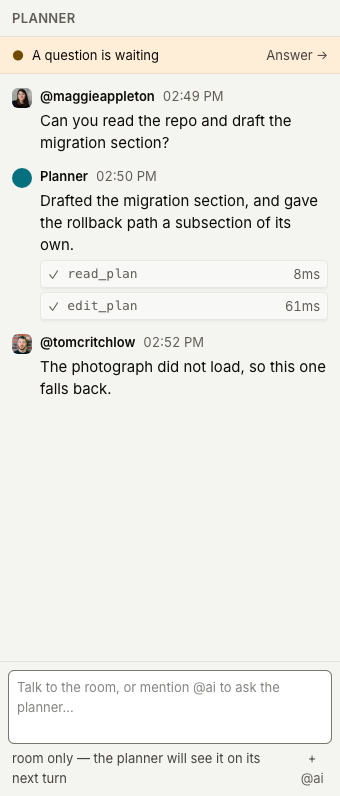
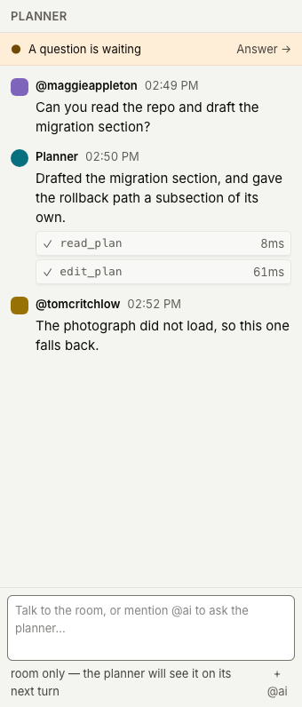
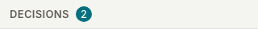
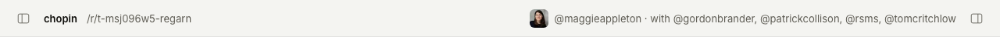

## Context

Every value is on the canvas, and the canvas is readable over MCP — open the
frames rather than working from the images.

- Badges, counts & status — https://www.figma.com/design/Px4tP6QSzRgNe6St0Yah64?node-id=71-2
- Avatars & the AI badge — https://www.figma.com/design/Px4tP6QSzRgNe6St0Yah64?node-id=73-2


## Goal

Rebuild everything that reports state without being operated — the status
dot, the notice pill, every count, and the avatar fallback.

## Notes

A healthy plan still says nothing. Everything here is an exception being
reported, which is the argument for keeping each one small.

The dot and the pill keep the construction they already have and only change
colour and size: 6px filled with the text colour beside it, and a fully
rounded white pill with the hairline and the resting shadow when a state
earns words. The pill's text was 10px and moves to 13px, which makes it
about a third taller — expected, not a regression.

All three counts take the petrol pill: the decisions rail header, a quoted
span's replies, and the overflow on a stack of faces. A bare number stopped
the rail header reading as anything to act on, and a grey pill said there was
a number without saying it mattered. One treatment means a reply count now
carries the same weight as an outstanding decision — if that proves too loud
in use, the quote is the one to demote, not the rail.

Avatars lose their lettering entirely. Both were 8px text inside a 20px
circle, and the scale now stops at 13px. Exempting monograms from the scale
was rejected as a rule everyone would have to remember; growing the mark to
28px was rejected for taking 8px of width from every message in the rail.

Shape then carries kind, which is 010's decision applied everywhere rather
than only in the chat rail. A person is a filled rounded square in their
account colour; the agent is a filled circle in petrol. Confining the square
to chat was rejected outright — the presence stack and the header would have
shown the same person as a circle, so one person would have had two shapes on
one screen.

Identity now rests on shape, colour and the tooltip. In chat that is safe —
the name is always beside the mark. In the presence stack there is no name at
all, so two people on neighbouring account colours are only told apart by
hovering. Watch for that in use.

The tool-call outcome — a successful call losing its tick — is settled but
deliberately not in this task. The tool card is being redesigned with the
chat rail, and it should be touched once.

Depends on 003 and 004.

## Acceptance

- [x] The status dot is 6px and takes the colour of the text beside it
- [x] A healthy plan renders no status element on screen, and the label is
      still present for a screen reader
- [x] The notice pill is white with the 7% hairline and the resting shadow,
      fully rounded, at 13px
- [x] The decisions rail header, a quote's reply count and the presence
      overflow all render a petrol pill 20px tall with white figures
- [x] No avatar anywhere contains lettering
- [x] A failed photograph renders a filled rounded square in the account
      colour, and the agent renders a filled circle in petrol
- [x] The square and the circle are used on every surface that draws an
      avatar: the chat entry, the presence stack and the header
- [x] Avatars are 20px in a chat entry and the presence stack and 24px in the
      header, and overlapping faces keep a 2px white ring
- [ ] Screenshots of the decisions rail header, a reconnecting notice and an
      agent chat entry attached to the PR

## Evidence

The dot and the pill were already 6px and 13px on the right tokens when 003
landed, so `status.tsx` and its rules are untouched. Everything else moved.

The pill's resting shadow was not painting, and neither was any other shadow in
the app. `--shadow-color` was declared one line _above_ `--shadow-*: initial`,
and the reset clears its own namespace — so the tint never reached the built
CSS, every `rgb(var(--shadow-color) / n%)` became an invalid declaration, and
all three shadows computed to `none`. The source read correctly throughout,
`--shadow-color` was textually defined, and `check-tokens.ts` was satisfied by
the declaration being there. Moving it below the reset is the whole fix.

`check-tokens.ts` now refuses the pattern rather than being fooled by it: a
token declared above a namespace reset that would wipe it fails `bun run ci`.
Confirmed by putting the two lines back in their original order and watching it
fail, then restoring them.

Measured on the live pill after the fix, rather than read off classnames:

```
box-shadow    rgba(14,13,10,.03) 0 0 1px, rgba(14,13,10,.03) 0 1px 1px,
              rgba(14,13,10,.02) 0 3px 2px
outline       1px rgba(0,0,0,0.07)
border-radius 9999px
font-size     13px
background    oklch(1 0 0)
```

`packages/editor/src/face.tsx` is the one place either mark is drawn.
`apps/web/src/face.tsx` and the private copy inside `presence.tsx` are gone:
they were two components rendering the same person, which is how one screen
could have shown one person as a circle and a square at once. The photograph
takes the same rounded square as the fallback, because a shape that changed
with whether github.com answered would report the wrong fact.

`packages/editor/src/count.tsx` is the petrol pill, in all three named places.
The fourth bare number — the "show in plan" count inside a question card, in
`packages/question` — is deliberately left grey. The task names three counts
and that is not one of them, so promoting it is a decision for whoever owns
that card.

The header drew no avatar at all before this. Acceptance names it as a face
surface, so the signed-in user's face is now there at 24px; the roster text
beside it is unchanged.

The rounded square takes `--radius-md`, 6px. The canvas gives no radius for it
— frame 73-2 still draws people as circles, which the Notes supersede — so the
value is read off the chat rail in `images/010-1.png` and rounded to the
nearest rung on the scale.








Captured against a seeded transcript on a server with `AGENT=off`, since an
agent entry is otherwise only reachable through a real turn. Photographs were
refused at the network layer for the two fallback pictures, which is how 004
exercised the same path. The notice is a clipped page region rather than an
element screenshot: the resting shadow is 3% at 3px, so a shot cropped to the
pill's own box would cut off the thing the box is about.

Not shown: the pill on a quote. A thread's count only passes one once an
accepted comment has produced prose in more than one block, which needs an
agent turn to stage. It is the same `Count` as the two above.

The last box stays open, and cannot be closed from here. Attaching screenshots
to a PR needs a PR, a PR needs a push, and this branch is under instruction not
to be pushed. The three images the box names are committed and ready:
`images/009-decisions-header.png`, `images/009-reconnecting.png` and
`images/009-chat-entries.png`.
