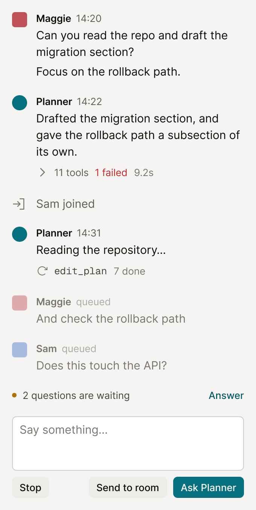

## Context

Every value is on the canvas, and the canvas is readable over MCP — open the
frames rather than working from the image.

- Chat rail, settled — https://www.figma.com/design/Px4tP6QSzRgNe6St0Yah64?node-id=101-2
- The tool run, and what lost — https://www.figma.com/design/Px4tP6QSzRgNe6St0Yah64?node-id=82-2
- The entry, and what lost — https://www.figma.com/design/Px4tP6QSzRgNe6St0Yah64?node-id=85-2
- The chrome, and what lost — https://www.figma.com/design/Px4tP6QSzRgNe6St0Yah64?node-id=99-2

A turn of eleven tool calls currently draws eleven bordered, filled boxes with
a tick on each — more pixels spent on containers than on anything a reader
wanted. This is the complaint the redesign started from.

## Goal

Collapse the tool run to a single line that never changes height, group
messages by author, distinguish people from the agent by shape, and replace
the pane header and the mention token with a composer that says where a
message is going.

## Notes

The run is one line in every state, and only one line. While it runs the line
carries a spinner, the raw tool name, and a count of what is already done.
Once it finishes the line carries a caret, a count of tools, a count of
failures when there are any, and an elapsed time — and names no tool at all.
Opening it lists one row per call: raw name left, cost right.

Rejected, and why:

- A container per call, which is today's. Chrome outweighed content.
- Plain rows, wrapping chips, and rows held by a rule down the left. All three
  read well at four calls and all three grow with the run. Real runs pass ten.

Tool names stay raw. A readable phrase — "Editing plan" — was drawn and
dropped: it needs a name-to-phrase table kept in step with the agent's tool
list, and the only line that ever names a tool is the one still running, so
there is no past-tense surface that would pay for it. The spinner carries the
fact that it is still going.

Shape carries kind. A person is a rounded square, the agent is a circle.
Removing the mark from people entirely was tried and rejected for leaving the
rail's left edge ragged, with people's text starting 28px left of the agent's.
009 is amended to match, so the shape means the same thing on every surface.

Names are capitalised and never carry an `@`. The symbol does not render in
the rail at all — not in a name, not in a mention, not in a hint. It may stay
as a typing shortcut, but nothing draws it.

A repeat from the same author is another paragraph in the same column, with no
second mark and no second name row. A queued message uses that same entry,
dimmed. A compact labelled list was rejected as a second way of drawing a
message.

No header. A label was rejected as naming something already obvious, and the
hairline under it put back a rule 005 removes from every pane edge. A facepile
was rejected for showing the room twice, since presence already sits on the
document.

The composer sends to one of two named places by button. A sticky
Room/Planner toggle was rejected because a switch left set sends somewhere
nobody was thinking about; an addressed chip was rejected for keeping a hidden
token as the real mechanism.

Stop joins the composer's button row. The cost is real and knowingly taken:
"working on Maggie's message" has nowhere left to go, so a reader sees that a
turn is running but not whose. The message being answered is the last one
above the live entry, and that is where it has to be read from now. If that
proves to be a loss in use, a line above the field is where it goes back.

Depends on 003, 005, 007 and 009.

## Acceptance

The run

- [ ] A tool run renders as one line, and that line's height is the same
      running, finished, and finished with a failure
- [ ] A running line shows the raw tool name and a count of completed calls
- [ ] A finished line shows a tool count and an elapsed time, names no tool,
      and shows a failure count only when there was one
- [ ] A failure count renders in destructive
- [ ] Opening a run lists every call, one row each, raw name left and cost right
- [ ] No tool call renders a border or a fill in any state

The entry

- [ ] A person's mark is a 20px rounded square in their account colour and the
      agent's is a 20px circle in petrol
- [ ] A second consecutive message from the same author renders no mark and no
      name row
- [ ] A system entry renders an icon in the mark's column and its text at 15px,
      upright rather than italic
- [ ] No `@` renders anywhere in the chat rail

The chrome

- [ ] The chat rail renders no header element
- [ ] The composer has two send controls, one naming the room and one naming
      the planner
- [ ] Stop renders in the composer's button row, and only while a turn is
      running
- [ ] A queued message renders in the same shape as a sent one, dimmed, and its
      author can withdraw it
- [ ] With questions outstanding, a line above the composer shows the count and
      a control that brings them into view in the decisions rail

Evidence

- [ ] Screenshots of a running turn with a message queued behind it, and of a
      finished turn with a failed call opened, attached to the PR
